# CSP Lab - Content Security Policy in Modern Web Apps


[](https://quarkus.io/)
[](https://openjdk.org/)
[](LICENSE.md)
[](https://github.com/amusarra/csp-lab-poc/actions/workflows/build.yml)
[](https://github.com/amusarra/csp-lab-poc/actions/workflows/presentation.yml)

> Laboratorio pratico per apprendere e sperimentare con le Content Security Policy (CSP) in applicazioni web moderne, con PoC basata su Quarkus.

## 📑 Indice

- [Introduzione](#-introduzione)
- [Cos'è la CSP](#-cosè-la-csp)
- [Architettura del Progetto](#-architettura-del-progetto)
- [Prerequisiti](#-prerequisiti)
- [Struttura del Progetto](#-struttura-del-progetto)
- [Configurazione](#-configurazione)
- [Compilazione](#-compilazione)
- [Esecuzione](#-esecuzione)
- [Deployment con Docker Compose](#-deployment-con-docker-compose)
- [Scenari Demo](#-scenari-demo)
- [Testing e Debugging](#-testing-e-debugging)
- [Risorse](#-risorse)
- [Licenza](#-licenza)

## 🎯 Introduzione

**CSP Lab** è un progetto educativo che dimostra come implementare e configurare Content Security Policy (CSP) in applicazioni web moderne basate su Quarkus. Il laboratorio copre:

- ✅ Implementazione di CSP dinamiche con **nonce** per richiesta
- ✅ Utilizzo di **hash** e **Subresource Integrity (SRI)** per risorse esterne
- ✅ Configurazione multilivello (Application, Reverse Proxy, API Gateway)
- ✅ Mitigazione di attacchi **XSS** (Cross-Site Scripting)
- ✅ Report delle violazioni CSP
- ✅ Best practices per deployment sicuro

Il progetto include esempi pratici di vulnerabilità XSS e dimostra come la CSP le mitiga efficacemente.

## 🛡️ Cos'è la CSP

La **Content Security Policy** è un meccanismo di sicurezza implementato via header HTTP che permette di controllare quali risorse (script, stili, immagini, font, connessioni, ecc.) il browser può caricare ed eseguire.

### Obiettivi principali

1. **Mitigare XSS**: Blocca l'esecuzione di script inline non autorizzati
2. **Prevenire clickjacking**: Controlla chi può incorniciare la pagina (`frame-ancestors`)
3. **Ridurre data injection**: Limita le origini delle risorse
4. **Defense in depth**: Si aggiunge ad altre protezioni (escaping, sanitizzazione)

### CSP vs X-XSS-Protection

| Caratteristica | CSP | X-XSS-Protection |
|----------------|-----|------------------|
| **Supporto** | Standard moderno, ampiamente supportato | Deprecato, rimosso da Chromium/Edge |
| **Copertura** | Controllo granulare su tutte le risorse | Solo reflected XSS semplici |
| **Efficacia** | Difesa robusta e configurabile | Facilmente bypassabile |
| **Raccomandazione** | ✅ **Usare sempre** | ❌ Disabilitare con `X-XSS-Protection: 0` |

### Strategie di deployment

La CSP può essere impostata a diversi livelli:

- **Applicazione** (Quarkus): Massimo controllo, supporto nonce dinamici
- **Reverse Proxy** (Nginx/Apache): Performante, separazione ops/dev
- **API Gateway** (Kong, Apigee): Centralizzazione per microservizi

> ⚠️ **Importante**: Più header CSP si sommano (intersezione). Scegliere un punto di verità per evitare conflitti.

## 🏗️ Architettura del Progetto

```mermaid
flowchart TB
    Browser["🌐 Browser<br/><small>DevTools: Visualizza violazioni CSP</small>"]
    
    subgraph ReverseProxy["🔄 Reverse Proxy (Nginx)"]
        direction TB
        NginxCSP["CSP statica<br/>(frame-ancestors, base-uri)"]
        NginxLB["Load balancing"]
        NginxTLS["TLS termination"]
    end
    
    subgraph QuarkusApp["☕ Quarkus Application"]
        direction TB
        
        subgraph Filters["Filters Layer"]
            CspFilter["🛡️ CspFilter<br/><small>ContainerRequestFilter/ResponseFilter</small><br/>━━━━━━━━━━━━━━━<br/>• Genera nonce per richiesta<br/>• Imposta header CSP dinamico<br/>• Supporta override e report-only"]
        end
        
        subgraph Resources["Resources Layer"]
            NonceResource["📄 NonceResource<br/>━━━━━━━━━━━━━━━<br/>• Endpoint: /nonce<br/>• Template Qute con nonce injection"]
            CspReportResource["📊 CspReportResource<br/>━━━━━━━━━━━━━━━<br/>• Endpoint: /csp-report<br/>• Riceve e logga violazioni CSP"]
            StaticTemplates["📁 Static Templates<br/>━━━━━━━━━━━━━━━<br/>• /pub/no-csp.html<br/>• /pub/dom-based-xss.html<br/>• /pub/hash-sri.html"]
        end
    end
    
    Browser -->|"HTTP Request"| ReverseProxy
    ReverseProxy -->|"Proxy Pass"| CspFilter
    CspFilter -.->|"Intercetta"| NonceResource
    CspFilter -.->|"Intercetta"| StaticTemplates
    Browser -.->|"POST Report"| CspReportResource
    
    style Browser fill:#e3f2fd,stroke:#1976d2,stroke-width:2px,color:#000
    style ReverseProxy fill:#fff3e0,stroke:#f57c00,stroke-width:2px
    style NginxCSP fill:#ffe0b2,stroke:#f57c00,stroke-width:1px,color:#000
    style NginxLB fill:#ffe0b2,stroke:#f57c00,stroke-width:1px,color:#000
    style NginxTLS fill:#ffe0b2,stroke:#f57c00,stroke-width:1px,color:#000
    style QuarkusApp fill:#e8f5e9,stroke:#388e3c,stroke-width:2px
    style Filters fill:#c8e6c9,stroke:#388e3c,stroke-width:1px
    style Resources fill:#c8e6c9,stroke:#388e3c,stroke-width:1px
    style CspFilter fill:#a5d6a7,stroke:#2e7d32,stroke-width:2px,color:#000
    style NonceResource fill:#a5d6a7,stroke:#2e7d32,stroke-width:1px,color:#000
    style CspReportResource fill:#a5d6a7,stroke:#2e7d32,stroke-width:1px,color:#000
    style StaticTemplates fill:#a5d6a7,stroke:#2e7d32,stroke-width:1px,color:#000
```



### Componenti principali

#### 1. CspFilter

Filtro JAX-RS che:
- Genera un **nonce unico** per ogni richiesta
- Imposta l'header `Content-Security-Policy` (o `Content-Security-Policy-Report-Only`)
- Supporta configurazione dinamica via `application.properties`
- Può essere abilitato/disabilitato tramite la property `csp.filter.enabled`

#### 2. NonceResource

Endpoint REST che serve template HTML con nonce injection:
- Route: `/nonce`
- Recupera il nonce dalla `ContainerRequestContext`
- Passa il nonce al template Qute per l'uso in script/style inline

#### 3. CspReportResource

Endpoint per ricevere report di violazioni CSP:
- Route: `/csp-report`
- Content-Type: `application/csp-report`
- Logga le violazioni in formato pretty-print JSON

#### 4. Template Statici

File HTML dimostrativi sotto `/pub`:
- **no-csp.html**: Script inline bloccato da CSP
- **dom-based-xss.html**: Esempio di DOM-based XSS e mitigazione
- **hash-sri.html**: Subresource Integrity con Bootstrap CDN

## ✅ Prerequisiti

### Software richiesto

- **Java 21** o superiore ([OpenJDK](https://openjdk.org/))
- **Maven 3.9+** (incluso wrapper `mvnw`)
- **Podman 5.2.x** e **Podman Compose 2.3.x** (opzionale, per deployment con Nginx). Per Docker, sostituire `podman` con `docker`.

### Verifica installazione

```bash
# Java version
java -version

# Maven version
./mvnw --version

# Podman version (opzionale)
podman version
podman compose version
```

## 📂 Struttura del Progetto

```
csp-lab/
├── pom.xml                             # Maven POM con dipendenze Quarkus
├── mvnw, mvnw.cmd                      # Maven wrapper
├── README.md                           # Questo file
├── src/
│   └── main/
│       ├── java/io/github/amusarra/csp/
│       │   ├── filter/
│       │   │   └── CspFilter.java      # Filtro CSP principale
│       │   └── resources/
│       │       ├── NonceResource.java  # Endpoint /nonce
│       │       └── reports/
│       │           └── CspReportResource.java  # Endpoint /csp-report
│       ├── resources/
│       │   ├── application.properties  # Configurazione Quarkus
│       │   ├── META-INF/resources/
│       │   │   └── fonts/              # Font AWSone (woff2, woff)
│       │   └── templates/
│       │       ├── nonce-index.html    # Template Qute con nonce
│       │       └── pub/                # Template statici (Qute Web)
│       │           ├── no-csp.html
│       │           ├── dom-based-xss.html
│       │           └── hash-sri.html
│       ├── docker/
│       │   ├── Dockerfile.jvm          # Immagine Docker per JVM mode
│       │   ├── Dockerfile.native       # Immagine Docker per native mode
│       │   ├── docker-compose.yml      # Stack completo con Nginx
│       │   └── nginx/
│       │       └── templates/
│       │           └── app-proxy.conf.template  # Template Nginx con CSP
│       └── docs/
│           └── slides/
│               └── content-security-policy-modern-web-apps.md  # Presentazione
└── target/                             # Build artifacts (generato)
```

## ⚙️ Configurazione

Il progetto si configura tramite il file `src/main/resources/application.properties`.

### Proprietà CSP Filter

```properties
# Abilita/disabilita il filtro CSP (build-time property)
csp.filter.enabled=true

# Modalità report-only (utile per tuning senza bloccare)
csp.filter.report-only=false

# Se false, non sovrascrive header CSP già presenti (es. da reverse proxy)
csp.filter.override=false

# Endpoint per i report di violazione
csp.filter.report-uri=/csp-report

# Policy di default (opzionale)
# Se non specificata, il filtro genera una policy dinamica con nonce
# Placeholder {nonce} viene sostituito con il nonce generato
# csp.filter.default-policy=default-src 'self'; script-src 'self' 'nonce-{nonce}'; ...
```

### Configurazione per profilo Dev

Durante lo sviluppo è utile usare la modalità `Report-Only`:

```properties
# Profilo dev: osserva violazioni senza bloccare
%dev.quarkus.http.header."Content-Security-Policy-Report-Only".value=default-src 'self'; frame-ancestors 'none'; base-uri 'self'
%dev.quarkus.http.header."Content-Security-Policy-Report-Only".path=/*
```

### Policy di default dinamica

Se `csp.filter.default-policy` non è impostata, il filtro genera automaticamente:

```plain
default-src 'self'; 
script-src 'self' 'nonce-{nonce}' 'strict-dynamic' https:; 
style-src 'self' 'nonce-{nonce}' https:; 
font-src 'self' data: https:; 
img-src 'self' data:; 
connect-src 'self'; 
frame-ancestors 'none'; 
base-uri 'self'; 
upgrade-insecure-requests; 
report-uri /csp-report;
```

### Configurazione avanzata

Per policy personalizzate, imposta `csp.filter.default-policy`:

```properties
csp.filter.default-policy=default-src 'self'; \
  script-src 'self' 'nonce-{nonce}' 'strict-dynamic' https:; \
  style-src 'self' 'unsafe-inline'; \
  font-src 'self' data: https://cdn.example.com; \
  connect-src 'self' https://api.example.com; \
  frame-ancestors 'none'; \
  base-uri 'self'; \
  report-uri /csp-report;
```

## 🔨 Compilazione

### Compilazione standard (JVM mode)

```bash
# Compila il progetto
./mvnw clean package

# Output: target/csp-lab-1.0.0-SNAPSHOT.jar
#         target/quarkus-app/quarkus-run.jar
```

### Compilazione nativa (GraalVM)

Per un eseguibile nativo con startup ultra-rapido:

```bash
# Richiede GraalVM installato
./mvnw clean package -Pnative

# Con Podman (senza GraalVM locale)
./mvnw clean package -Pnative -Dquarkus.native.container-build=true

# Con Podman e immagine specifica
./mvnw clean package -Pnative -Dquarkus.native.container-build=true \
  -Dquarkus.native.builder-image=quay.io/quarkus/ubi-quarkus-mandrel-builder-image:jdk-21

# Output: target/csp-lab-1.0.0-SNAPSHOT-runner (eseguibile nativo)
```

### Build Container Image

```bash
# JVM mode
podman build -f src/main/docker/Dockerfile.jvm -t csp-lab:jvm .

# Native mode
podman build -f src/main/docker/Dockerfile.native -t csp-lab:native .
```

## 🚀 Esecuzione

### Modalità Development (con live reload)

```bash
./mvnw quarkus:dev
```

L'applicazione sarà disponibile su:
- **http://localhost:8080** - Applicazione principale
- **http://localhost:8080/q/dev** - Dev UI (dashboard Quarkus)

### Modalità Production (JAR)

```bash
java -jar target/quarkus-app/quarkus-run.jar
```

### Modalità Native

```bash
./target/csp-lab-1.0.0-SNAPSHOT-runner
```

### Endpoint disponibili

| Endpoint | Descrizione | CSP Mode |
|----------|-------------|----------|
| `/nonce` | Template con nonce dinamico | Filtro applicativo |
| `/no-csp.html` | Script inline bloccato | Qute Web + properties |
| `/dom-based-xss.html` | Esempio XSS DOM-based | Qute Web + properties |
| `/hash-sri.html` | Subresource Integrity | Qute Web + properties |
| `/csp-report` | Endpoint per report violazioni | - |
| `/q/health` | Health check | - |
| `/q/metrics` | Metriche Micrometer | - |

## 🐳 Deployment con Docker Compose

Il progetto include una configurazione Docker Compose che dimostra:

- Gestione CSP multilivello (Applicazione + Reverse Proxy)
- Separazione delle responsabilità
- Evitare conflitti tra policy

### Architettura dello stack


**Legenda connessioni:**
- ━━━ **Linea continua**: Flusso HTTP principale
- ┈┈┈ **Linea tratteggiata**: Connessione debug/network interno

### Avvio dello stack

```bash
# Build e avvio
podman compose -f src/main/docker/docker-compose.yml up --build

# Avvio in background
podman compose -f src/main/docker/docker-compose.yml up -d

# Verifica log
podman compose -f src/main/docker/docker-compose.yml logs -f 

# Stop
podman compose -f src/main/docker/docker-compose.yml down
```

### Configurazione CSP su Nginx

La policy CSP del reverse proxy si configura tramite variabile d'ambiente:

```yaml
# docker-compose.yml
services:
  reverse-proxy:
    image: nginx:1.29.4
    environment:
      - CSP_VALUE=default-src 'self'; script-src 'self'; object-src 'none';
```

Il template Nginx (`nginx/templates/app-proxy.conf.template`) inserisce la policy:

```nginx
add_header Content-Security-Policy "$CSP_VALUE" always;
```

### Accesso ai servizi

- **Via Nginx (CSP multilivello)**: http://localhost:8080
- **Diretto su Quarkus (bypass Nginx)**: http://localhost:8081

### Pattern consigliato multilivello

```mermaid
flowchart LR
    Request[HTTP Request]
    
    subgraph EdgeLayer["🔄 Edge Layer (Nginx)"]
        EdgeCSP["CSP Statica<br/>━━━━━━━━━━━━━━━<br/>frame-ancestors 'none'<br/>base-uri 'self'<br/>upgrade-insecure-requests"]
    end
    
    subgraph AppLayer["☕ Application Layer (Quarkus)"]
        AppCSP["CSP Dinamica<br/>━━━━━━━━━━━━━━━<br/>script-src 'self' 'nonce-{nonce}'<br/>style-src 'self' 'nonce-{nonce}'<br/>connect-src 'self'"]
    end
    
    subgraph Browser["🌐 Browser"]
        MergedCSP["Policy Finale<br/>━━━━━━━━━━━━━━━<br/>Intersezione delle policy<br/>(più restrittiva vince)"]
    end
    
    Request --> EdgeLayer
    EdgeLayer --> AppLayer
    AppLayer --> Browser
    
    style Request fill:#e1f5ff,stroke:#1976d2,stroke-width:2px,color:#000
    style EdgeLayer fill:#fff3e0,stroke:#f57c00,stroke-width:2px
    style EdgeCSP fill:#ffe0b2,stroke:#f57c00,stroke-width:1px,color:#000
    style AppLayer fill:#e8f5e9,stroke:#388e3c,stroke-width:2px
    style AppCSP fill:#c8e6c9,stroke:#388e3c,stroke-width:1px,color:#000
    style Browser fill:#e3f2fd,stroke:#1976d2,stroke-width:2px
    style MergedCSP fill:#bbdefb,stroke:#1976d2,stroke-width:1px,color:#000
```



#### Configurazione consigliata

**Nginx (Edge Layer)** - Policy statiche e invariabili:

```csp
frame-ancestors 'none'; 
base-uri 'self'; 
upgrade-insecure-requests;
```

**Quarkus (Application Layer)** - Policy dinamiche con nonce:

```csp
default-src 'self'; 
script-src 'self' 'nonce-{nonce}' 'strict-dynamic' https:; 
style-src 'self' 'nonce-{nonce}' https:;
font-src 'self' data: https:;
img-src 'self' data:;
connect-src 'self';
report-uri /csp-report;
```

#### Best Practices per deployment multilivello

```mermaid
flowchart TD
    Start([Configurazione CSP])
    
    Decision{Tipo di direttiva?}
    
    Start --> Decision
    
    Decision -->|Statica<br/>Invariabile| EdgeConfig["✅ Configura su Nginx<br/>━━━━━━━━━━━━━━━<br/>• frame-ancestors<br/>• base-uri<br/>• upgrade-insecure-requests"]
    
    Decision -->|Dinamica<br/>Richiede nonce| AppConfig["✅ Configura su Quarkus<br/>━━━━━━━━━━━━━━━<br/>• script-src<br/>• style-src<br/>• connect-src<br/>• report-uri"]
    
    Decision -->|Entrambi i livelli| Conflict["❌ CONFLITTO!<br/>━━━━━━━━━━━━━━━<br/>Il browser applicherà<br/>l'intersezione<br/>(più restrittiva)"]
    
    EdgeConfig --> Test[Test e Validazione]
    AppConfig --> Test
    Conflict --> Fix[Rimuovi da un livello]
    Fix --> Test
    
    Test --> Done([✅ Deploy Sicuro])
    
    style Start fill:#e1f5ff,stroke:#1976d2,stroke-width:2px,color:#000
    style Decision fill:#fff9e1,stroke:#f57c00,stroke-width:2px,color:#000
    style EdgeConfig fill:#e8f5e9,stroke:#388e3c,stroke-width:2px,color:#000
    style AppConfig fill:#e8f5e9,stroke:#388e3c,stroke-width:2px,color:#000
    style Conflict fill:#ffcdd2,stroke:#c62828,stroke-width:2px,color:#000
    style Fix fill:#fff3e0,stroke:#f57c00,stroke-width:2px,color:#000
    style Test fill:#e1f5ff,stroke:#1976d2,stroke-width:2px,color:#000
    style Done fill:#c8e6c9,stroke:#2e7d32,stroke-width:2px,color:#000
```



#### Esempio pratico di configurazione

**File: `src/main/docker/docker-compose.yml`**

```yaml
services:
  reverse-proxy:
    environment:
      # Solo direttive statiche su Nginx
      - CSP_VALUE=frame-ancestors 'none'; base-uri 'self'; upgrade-insecure-requests;
```

**File: `src/main/resources/application.properties`**

```properties
# Policy dinamica su Quarkus (con nonce gestito dal CspFilter)
csp.filter.enabled=true
csp.filter.override=false  # Non sovrascrivere header Nginx
```

Con questa configurazione:

- ✅ Nginx applica policy statiche su **tutte** le risposte
- ✅ Quarkus aggiunge policy dinamiche con nonce
- ✅ Il browser riceve **entrambi** gli header e li combina (intersezione)
- ✅ Nessun conflitto perché le direttive sono **complementari**

> ⚠️ **Attenzione**: Se imposti `script-src` sia su Nginx che su Quarkus, il browser userà l'intersezione. Esempio:
>
> - Nginx: `script-src 'self' https://cdn.example.com;`
> - Quarkus: `script-src 'self' 'nonce-abc123';`
> - **Risultato**: `script-src 'self';` (solo l'origine comune!)
>
> **Soluzione**: Lascia `script-src` solo su Quarkus dove viene gestito il nonce.

## 🧪 Scenari Demo

### 1. Script inline bloccato (`/no-csp.html`)

**Obiettivo**: Dimostrare come la CSP blocca script inline non autorizzati.

```bash
# Apri nel browser
open http://localhost:8080/no-csp.html
```

**Risultato atteso**:

- ❌ L'alert XSS **non** viene eseguito
- ✅ La console DevTools mostra violazione CSP:

```plain
Refused to execute inline script because it violates the following
Content Security Policy directive: "script-src 'self'".
```

### 2. Nonce dinamico (`/nonce`)

**Obiettivo**: Mostrare come il nonce autorizza script inline legittimi.

```bash
# Apri nel browser
open http://localhost:8080/nonce
```

**Risultato atteso**:

- ✅ Script con `nonce="{nonce}"` viene eseguito
- ❌ Script senza nonce viene bloccato
- ℹ️ Il nonce è visualizzato nella pagina

**Verifica DevTools**:

```plain
Headers > Response Headers:
  Content-Security-Policy: default-src 'self'; script-src 'self' 'nonce-abc123...'
  X-CSP-Nonce: abc123...
```

### 3. DOM-based XSS (`/dom-based-xss.html`)

**Obiettivo**: Dimostrare come la CSP mitiga XSS basati su DOM manipulation.

```bash
# Payload XSS nell'hash
open "http://localhost:8080/dom-based-xss.html#"
```

**Risultato atteso**:

- ❌ Il payload `onerror=alert('XSS')` **non** viene eseguito
- ✅ DevTools mostra blocco CSP
- ℹ️ La sezione "Sicuro" mostra il payload come testo

### 4. Subresource Integrity (`/hash-sri.html`)

**Obiettivo**: Mostrare l'uso di SRI con CSP per risorse CDN.

```bash
# Apri nel browser
open http://localhost:8080/hash-sri.html
```

**Risultato atteso**:

- ✅ Bootstrap CSS caricato correttamente (hash valido)
- ✅ Primo script JS caricato (hash valido)
- ❌ Secondo script JS bloccato (hash errato)

**DevTools**:

```plain
Failed to find a valid digest in the 'integrity' attribute for resource
'https://cdn.jsdelivr.net/.../bootstrap.bundle.min.js' with computed SHA-384
integrity '...'. The resource has been blocked.
```

## 🔍 Testing e Debugging


### Verifica header CSP

```bash
# Header dell'applicazione
curl -I http://localhost:8080/nonce

# Header del reverse proxy
curl -I http://localhost:8080/no-csp.html
```

### Visualizzazione report violazioni

I report CSP vengono loggati da `CspReportResource`:

```bash
# Tail dei log
./mvnw quarkus:dev

# In un altro terminale, forza una violazione
open "http://localhost:8080/no-csp.html"
```

**Output log** (pretty-print JSON):

```json
2026-01-21 10:30:45,123 WARN  [reports.resources.io.github.amusarra.csp.CspReportResource] !!! VIOLAZIONE CSP RILEVATA !!!
{
  "csp-report": {
    "document-uri": "http://localhost:8080/no-csp.html",
    "referrer": "",
    "violated-directive": "script-src-elem",
    "effective-directive": "script-src-elem",
    "original-policy": "default-src 'self'; script-src 'self'; ...",
    "blocked-uri": "inline",
    "status-code": 200
  }
}
```

### DevTools - Security Panel

Chrome/Edge DevTools > **Security** tab mostra:

- ✅ CSP header presente
- ⚠️ Violazioni rilevate
- ℹ️ Direttive attive

### CSP Evaluator (Google)

```bash
# Estrai policy corrente
curl -s -I http://localhost:8080/nonce | grep -i content-security-policy

# Copia l'output e incollalo su:
open https://csp-evaluator.withgoogle.com/
```

### Test automatizzati

```bash
# Unit test
./mvnw test

# Integration test
./mvnw verify
```

### Security Headers Check

```bash
# Verifica header di sicurezza in produzione
open https://securityheaders.com/?q=https://your-domain.com
```

## 📚 Risorse

### Specifiche e Standard

- [MDN - Content Security Policy](https://developer.mozilla.org/en-US/docs/Web/HTTP/CSP)
- [W3C CSP Level 3](https://www.w3.org/TR/CSP3/)
- [W3C CSP Level 4 (Draft)](https://w3c.github.io/webappsec-csp/)

### Tool e Utility

- [Google CSP Evaluator](https://csp-evaluator.withgoogle.com/)
- [SRI Hash Generator](https://www.srihash.org/)
- [Security Headers Checker](https://securityheaders.com/)
- [Report URI Service](https://report-uri.com/)

### Guide e Best Practices

- [OWASP CSP Cheat Sheet](https://cheatsheetseries.owasp.org/cheatsheets/Content_Security_Policy_Cheat_Sheet.html)
- [Google Web Fundamentals - CSP](https://developers.google.com/web/fundamentals/security/csp)
- [Quarkus Security Guide](https://quarkus.io/guides/security)

### Presentazione

Il progetto include una presentazione completa (Marp):

```bash
# Apri la presentazione
open src/main/docs/slides/content-security-policy-modern-web-apps.md
```

Argomenti trattati:

- ✅ Introduzione alla CSP
- ✅ Direttive principali (`script-src`, `style-src`, ecc.)
- ✅ Strategie di deployment (App, Gateway, Reverse Proxy)
- ✅ Nonce vs Hash (decision tree)
- ✅ Subresource Integrity (SRI)
- ✅ PoC Quarkus con codice
- ✅ Testing e strumenti
- ✅ Rollout sicuro (Report-Only → Enforce)

## 🤝 Contributi

I contributi sono benvenuti! Per contribuire:

1. Fork del repository
2. Crea un branch per la feature (`git checkout -b feature/AmazingFeature`)
3. Commit delle modifiche (`git commit -m 'Add some AmazingFeature'`)
4. Push del branch (`git push origin feature/AmazingFeature`)
5. Apri una Pull Request

## 📄 Licenza

Questo progetto è distribuito sotto licenza MIT. Vedi il file [LICENSE](LICENSE.md) per i dettagli.

## 👤 Autore

**Antonio Musarra** - Software Engineer @ Sogei

- Blog: [https://www.dontesta.it](https://www.dontesta.it)
- GitHub: [@amusarra](https://github.com/amusarra)
- LinkedIn: [Antonio Musarra](https://www.linkedin.com/in/amusarra/)

---

## 🚨 Avvertenze

Questo progetto è pensato **esclusivamente per scopi educativi e di ricerca**. Gli esempi di vulnerabilità XSS sono inclusi solo per dimostrare l'efficacia della CSP e **non devono essere usati in ambienti di produzione senza adeguata comprensione dei rischi**.

### Disclaimer

- ⚠️ Le demo XSS sono volutamente vulnerabili per scopi didattici
- ⚠️ Adattare sempre le policy CSP alle esigenze specifiche dell'applicazione
- ⚠️ Testare accuratamente in ambiente di staging prima del deploy in produzione
- ⚠️ La CSP è un controllo difensivo complementare, non sostituisce sanitizzazione e escaping

---

**Happy Secure Coding! 🔒**
