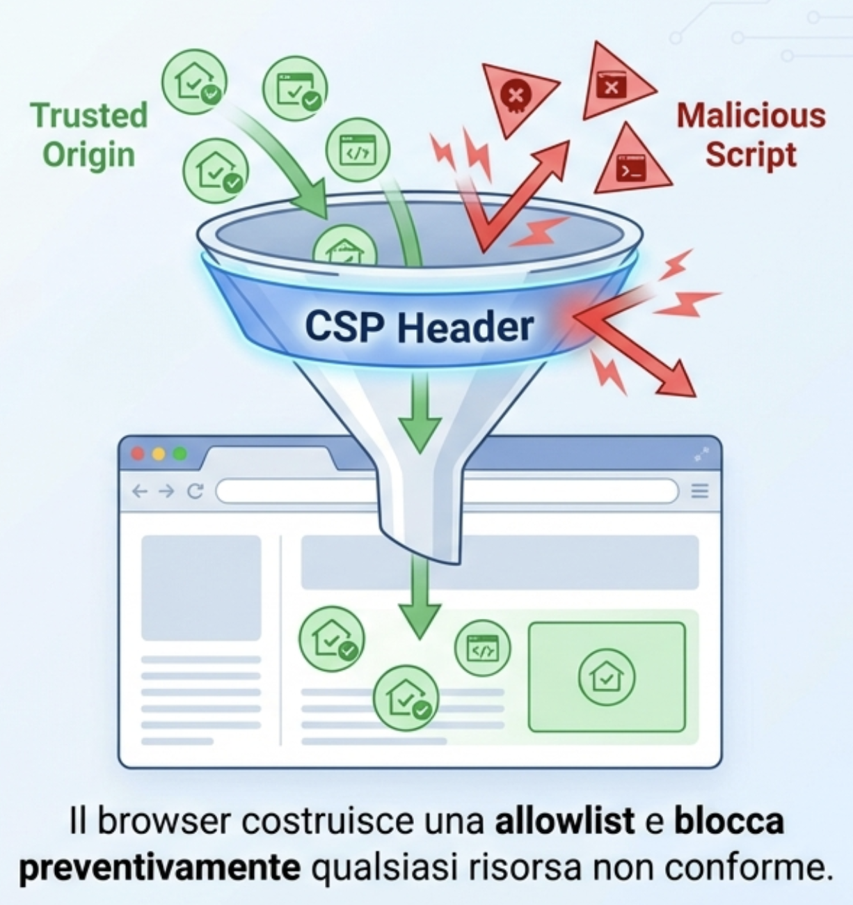
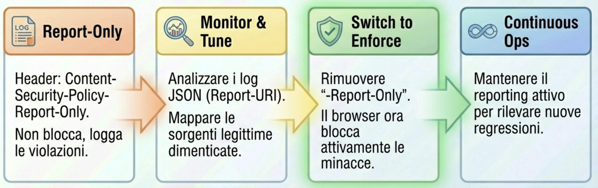

# Content Security Policy (CSP) in Modern Web Apps

## Difesa XSS e PoC con Quarkus

---

## Una storia vera (anonimizzata)

**Black Friday - 23 novembre 2019, ore 22:30**

Un grande e-commerce europeo di elettronica scopre un attacco XSS nel modulo di ricerca del sito.

- **17.500+ credenziali** rubate tramite keylogger JS iniettato
- Script malevolo attivo per **6 ore** durante il picco pre-Black Friday
- Dati compromessi: email, password, indirizzi, carte di credito
- Perdite stimate: **€2.8M** (sanzioni GDPR + risarcimenti + reputazione)
- **Causa**: mancanza di CSP e sanitizzazione input utente

> _"Un singolo header CSP avrebbe bloccato l'attacco."_

<!--
Note (relatore – storia vera):
- Obiettivo: catturare l'attenzione con un caso concreto e drammatico che dimostra l'impatto reale della mancanza di CSP.
- Racconto (30 secondi): "È il 23 novembre 2019, ore 22:30. Siamo a poche ore dal Black Friday, il momento più critico per gli e-commerce. Un grande retailer europeo di elettronica scopre un attacco XSS nel modulo di ricerca del sito. Un attaccante era riuscito a iniettare uno script malevolo - un keylogger JavaScript - che ha registrato ogni tasto digitato dagli utenti per 6 ore consecutive, proprio durante il picco di traffico pre-Black Friday."
- Impatto: "Il bilancio è devastante: oltre 17.500 credenziali compromesse - email, password, indirizzi, carte di credito. Le perdite economiche sono stimate in 2,8 milioni di euro tra sanzioni GDPR, risarcimenti ai clienti e danno reputazionale."
- Punto chiave: "La causa? Assenza totale di Content Security Policy e mancata sanitizzazione dell'input utente. Un singolo header HTTP - Content-Security-Policy - avrebbe immediatamente bloccato l'esecuzione dello script malevolo, impedendo l'intero attacco."
- Enfasi: pausa dopo la citazione finale per far riflettere l'audience sull'importanza della CSP.
- Transizione: "Questa non è fantascienza, ma realtà. Vediamo ora come la CSP può proteggerci da scenari come questo."
-->

---

## Agenda

- **Introduzione CSP**
- **Direttive principali**
- **Strategie & deployment** (App, Gateway, Reverse Proxy) + duplicati/multilivello
- **PoC Quarkus** (filtro vs proprietà, nonce/hash)
- **Testing & strumenti**

<!--
Note (relatore):
- Tempi indicativi: adatta in base alle domande.
- Obiettivo: baseline CSP + PoC concreta.
- Chiedi chi usa già CSP o gateway per tarare esempi.
-->

---

<!--
_class: compact
-->

## Cos’è la CSP e perché conta

- **Definizione**: Policy di sicurezza via header HTTP che limita le sorgenti di contenuti (script, stile, immagini, font, connessioni...).
- **Obiettivo**: Mitigare XSS, clickjacking e data injection riducendo la superficie di attacco.
- **Funzionamento**: Il browser applica le direttive e blocca contenuti non conformi.
- **Rollout sicuro**: Usa inizialmente `Content-Security-Policy-Report-Only` per osservare violazioni senza bloccare.
- **Versioni & specifiche**: [CSP Level 2](https://www.w3.org/TR/CSP2/), [CSP Level 3](https://www.w3.org/TR/CSP3/), [Level 4 (Draft)](https://w3c.github.io/webappsec-csp/), panoramica su [MDN](https://developer.mozilla.org/en-US/docs/Web/HTTP/Headers/Content-Security-Policy).



<!--
Note (relatore – Cos'è la CSP):
- Apertura: "Iniziamo dalle basi: cos'è esattamente la Content Security Policy e perché dovremmo preoccuparcene?"
- Definizione: "La CSP è essenzialmente una policy di sicurezza che comunichiamo al browser tramite un header HTTP. Funziona come una whitelist: specifichiamo da quali sorgenti il browser può caricare e eseguire contenuti - script JavaScript, fogli di stile, immagini, font, connessioni WebSocket e altro ancora."
- Obiettivo: "L'obiettivo principale è mitigare gli attacchi XSS - Cross-Site Scripting - che rappresentano ancora oggi una delle vulnerabilità più diffuse nelle applicazioni web. Ma non solo: la CSP ci protegge anche da clickjacking e data injection, riducendo drasticamente la superficie di attacco."
- Funzionamento: "Il meccanismo è elegante nella sua semplicità: definiamo le regole lato server, il browser le applica in modo nativo. Se uno script non rispetta le direttive della policy - ad esempio proviene da un dominio non autorizzato o è inline senza nonce - il browser lo blocca immediatamente."
- Rollout sicuro: "Un aspetto fondamentale per l'adozione: possiamo iniziare in modalità 'Report-Only', dove il browser non blocca nulla ma ci invia report sulle violazioni. Questo ci permette di osservare il comportamento reale dell'applicazione e perfezionare la policy prima di attivarla in modalità enforce."
- Specifiche: "La CSP è uno standard in evoluzione. Oggi abbiamo Level 2 e 3 completamente supportati, Level 4 in draft. Vi consiglio di consultare le risorse MDN per i dettagli specifici."
- Transizione: "Vediamo ora come si posiziona la CSP rispetto a meccanismi di sicurezza più datati."
-->

---

## CSP vs `X-XSS-Protection`

<!--
_class: compact
-->

- **Scopo**:
  - CSP: controllo delle origini dei contenuti (script, stile, img, ecc.) e mitigazione ampia di XSS/injection.
  - X-XSS-Protection: abilita/disabilita il vecchio filtro XSS del browser (riflected XSS) con `1`, `1; mode=block`, `0`.
- **Stato supporto**:
  - CSP: standard moderno, supporto trasversale.
  - X-XSS-Protection: deprecato/abbandonato nei browser moderni (Chromium/Edge lo hanno rimosso; Firefox non lo ha mai supportato; supporto incoerente altrove).
- **Limiti**:
  - CSP: richiede tuning ma offre difesa "in profondità" (nonce/hash, strict-dynamic, report).
  - X-XSS-Protection: copre solo riflessi semplici, facilmente bypassabile, può introdurre rotture o leak; non è difesa affidabile.
- **Raccomandazione**:
  - Preferisci CSP; continua a fare escaping/sanitizzazione lato server e client.
  - Disabilita esplicitamente il filtro legacy dove presente: `X-XSS-Protection: 0`.

<!--
Note (relatore – CSP vs X-XSS-Protection):
- Contesto: "Molti di voi potrebbero aver sentito parlare dell'header X-XSS-Protection. È importante capire perché oggi dobbiamo preferire la CSP."
- Differenza di scopo: "X-XSS-Protection era un tentativo dei browser di bloccare automaticamente reflected XSS rilevati nell'URL. Suona bene in teoria, ma in pratica aveva limiti enormi: copriva solo attacchi riflessi molto semplici, era facilmente bypassabile e - aspetto critico - poteva introdurre nuove vulnerabilità o causare malfunzionamenti dell'applicazione."
- Stato attuale: "La realtà è che questo header è ormai deprecato. Chromium ed Edge l'hanno completamente rimosso, Firefox non l'ha mai implementato, Safari ha supporto parziale. È uno strumento del passato."
- Superiorità della CSP: "La Content Security Policy invece è uno standard moderno, supportato universalmente, e offre un controllo granulare e affidabile. Non tenta di 'indovinare' gli attacchi - definisce regole precise su cosa è permesso e cosa no."
- Raccomandazione pratica: "La strategia corretta oggi è: implementate una CSP solida, continuate a fare escaping e sanitizzazione corretta dell'input lato server - questi sono i fondamentali - e dove ancora presente X-XSS-Protection, disabilitatelo esplicitamente con valore 0 per evitare falsi positivi."
- Transizione: "Ora che abbiamo chiarito il contesto, entriamo nel cuore della CSP: le sue direttive."
-->

---

## Direttive principali (panoramica)

- **default-src**: Fallback per tutte le tipologie (es. `'self'`).
- **script-src**: Sorgenti per JavaScript. Supporta `'nonce-<val>'`, `'sha256-<hash>'`, `'strict-dynamic'`, evita `'unsafe-inline'`.
- **style-src**: Sorgenti CSS. Preferisci hash/nonce, evita `'unsafe-inline'` se possibile.
- **img-src**: Sorgenti immagini (attenzione a `data:` e `blob:` se non necessari).
- **connect-src**: Endpoint fetch/XHR/WebSocket/EventSource.
- **font-src**, **media-src**, **frame-src**, **worker-src**: Tipologie specifiche.
- **frame-ancestors**: Controlla chi può incorniciare la pagina (anti-clickjacking).
- **base-uri**: Limita `<base>`;
- **upgrade-insecure-requests**: forza https.

<!--
Note (relatore – direttive principali):
- Obiettivo: chiarire ruolo di ogni direttiva e scelte sicure.
- default-src: fallback iniziale; usa 'self' come base, evita wildcard.
- script-src: evita 'unsafe-inline'/'unsafe-eval'; spiega nonce/hash e 'strict-dynamic' con esempi.
- style-src: preferisci hash/nonce; valuta se rimuovere 'unsafe-inline' (compatibilità librerie legacy).
- img-src: consenti data:/blob: solo se indispensabili (upload/canvas); evidenzia impatti su performance.
- connect-src: includi API, telemetria, WebSocket (wss://); evita '*', specifica domini.
- font-src/media-src/frame-src/worker-src: consenti solo origini necessarie; abbina SRI dove possibile.
- frame-ancestors: differenza rispetto a X-Frame-Options; mostra 'none' vs domini ammessi.
- base-uri: impedisce abuso di <base>; raccomanda 'self'.
- upgrade-insecure-requests: utile in migrazione a https; verifica asset misti.
Suggerimento: mostra in DevTools il blocco di uno script inline senza nonce per rendere tangibile l'effetto.
-->

---

## `script-src` in dettaglio

<!--
_class: compact
-->

- **Nonce**: Generato per richiesta, es. `'nonce-AbCd...'`; consenti solo script con quel attributo.
- **Hash**: `'sha256-...'` su contenuto inline deterministico.
- **strict-dynamic**: Con nonce/hash, delega fiducia a script caricati dinamicamente da quelli autorizzati.
- **Blocca inline non necessari**: Evita `'unsafe-inline'` e `'unsafe-eval'`.

Esempio sicuro:

```csp
Content-Security-Policy: default-src 'self'; \
 script-src 'self' 'nonce-{nonce}' 'strict-dynamic' https:; \
 style-src 'self' https:; img-src 'self' data:; \
 connect-src 'self' https://api.example.com; \
 frame-ancestors 'none'; base-uri 'self'; upgrade-insecure-requests;
```

<!--
Note (relatore - script-src):
 - Nonce vs Hash: nonce per contenuti inline dinamici per richiesta; hash per blocchi inline deterministici (build-time). Entrambi si possono combinare, ma privilegia nonce + 'strict-dynamic'.
 - 'strict-dynamic' affida fiducia agli script caricati da quelli con nonce/hash, riducendo la necessità di whitelist di host; mantieni comunque fallback https: per asset terzi.
 - Evita 'unsafe-inline' e 'unsafe-eval'; consenti 'unsafe-eval' solo se librerie legacy lo richiedono (valuta migrazione).
 - Event handlers inline: usa 'unsafe-hashes' con hash specifici quando devi supportare attributi come onclick.
 - WebAssembly: se necessario, considera 'wasm-unsafe-eval' con cautela.

 Quando usare cosa:
 - Usa **nonce** quando: il markup è generato al volo (template engine), ci sono piccoli blocchi inline che cambiano per richiesta/utente/tenant, vuoi sfruttare 'strict-dynamic' e ridurre whitelist di host.
 - Usa **hash** quando: il contenuto inline è stabile e versionato (snippet deterministici, es. bootstrapping minimo), non puoi gestire un nonce per-request (cache aggressive, pagine statiche), vuoi evitare propagazione del nonce.
 - Evita entrambi quando possibile: sposta il codice inline in file esterni versionati, firma con SRI e consenti solo origin fidati.
 Demo: in DevTools mostra blocco di <script> inline senza nonce; prova un dynamic import da host non whitelisted per evidenziare l'effetto di 'strict-dynamic'.
 Domanda guida: quali asset terzi usate oggi? Mappateli su https: + SRI e valutate se ridurre la whitelist.
-->

---

## Decision tree: nonce vs hash

- Il codice inline cambia per richiesta/utente? → Usa **nonce** + `'strict-dynamic'`.
- Il codice inline è stabile/versionato? → Usa **hash** (`'sha256-…'`).
- Hai cache aggressive/CDN di pagine statiche? → Preferisci **hash**.
- Vuoi ridurre whitelist host e script dinamici trusted? → **nonce** + `'strict-dynamic'`.
- Puoi evitare inline? → Sposta in file esterni + **SRI** (Subresource Integrity); mantieni CSP più semplice.

<!--
Note (relatore – Decision tree):
- Obiettivo: "Abbiamo parlato di nonce e hash, ma quando usare l'uno o l'altro? Questa slide vi fornisce un albero decisionale pratico."
- Prima domanda: "Il vostro codice inline cambia per ogni richiesta o per utente? Pensate a contenuti personalizzati, token di sessione, dati dinamici. In questo caso, il nonce è la soluzione naturale: generate un valore random per ogni richiesta, lo includete nell'header CSP e negli attributi degli script legittimi."
- Contenuti stabili: "Se invece il codice inline è stabile - stesso contenuto per tutti gli utenti, versionato - allora l'hash è più appropriato. Calcolate l'hash SHA-256 del contenuto in fase di build e lo dichiarate nella policy. Niente generazione runtime, perfetto per pagine statiche."
- Cache e CDN: "Avete cache aggressive o CDN che servono pagine statiche? L'hash è ideale perché non richiede sincronizzazione di nonce tra richieste diverse."
- Script dinamici: "Volete ridurre la whitelist di host e gestire script caricati dinamicamente in modo sicuro? Nonce combinato con 'strict-dynamic' è il pattern moderno consigliato."
- Migliore pratica: "Ma ricordate: la soluzione più pulita è sempre evitare inline quando possibile. Spostate il codice in file esterni, versionate, applicate SRI e mantenete una CSP più semplice e manutenibile."
- Transizione: "Vediamo ora questo decision tree rappresentato visivamente."
-->

---

## Decision tree: nonce vs hash (diagramma)


<!--
Note (relatore – Diagramma decision tree):
- Presentazione: "Ecco rappresentato graficamente il processo decisionale che abbiamo appena discusso. Questo diagramma può essere un riferimento rapido quando dovete decidere l'approccio da adottare per il vostro progetto."
- Percorso visivo: "Seguite il flusso dall'alto: partite dalla natura del vostro contenuto inline, rispondete alle domande chiave - dinamico o statico, cache o no, necessità di script dinamici - e arrivate alla soluzione ottimale."
- Pratico: "Vi consiglio di salvare questo schema come riferimento per il team. È particolarmente utile durante le code review o quando integrate nuove funzionalità che richiedono script inline."
- Transizione: "Passiamo ora a un tema complementare ma altrettanto importante: la Subresource Integrity."
-->

---

<!--
_class: compact
-->

## Subresource Integrity (SRI)

- **Cos'è**: garantisce che asset esterni (script/stili) non siano stati manomessi. Il browser usa la risorsa solo se l'hash dichiarato nell'attributo `integrity` coincide con quello del contenuto scaricato.
- **Come si usa**: aggiungi `integrity="sha256|sha384|sha512-<hashBase64>"` e `crossorigin="anonymous"` su risorse da CDN/terze parti.
- **Relazione con CSP**: SRI assicura integrità del singolo asset; CSP controlla le origini consentite. Sono **complementari** e vanno usati insieme.
- **Nota compatibilità**: la direttiva CSP `require-sri-for` non è ampiamente supportata; applica SRI via build/pipeline invece di farlo imporre dalla CSP.

> Il sito https://srihash.org/ può aiutarti a generare gli hash SRI per le tue risorse esterne.


---

## Subresource Integrity (SRI) - esempi (1/2)

Esempi:

```html
<link href="https://cdn.jsdelivr.net/npm/bootstrap@5.3.8/dist/css/bootstrap.min.css" 
rel="stylesheet" 
integrity="sha384-sRIl4kxILFvY47J16cr9ZwB07vP4J8+LH7qKQnuqkuIAvNWLzeN8tE5YBujZqJLB" crossorigin="anonymous">

<script src="https://cdn.jsdelivr.net/npm/bootstrap@5.3.8/dist/js/bootstrap.bundle.min.js" 
integrity="sha384-FKyoEForCGlyvwx9Hj09JcYn3nv7wiPVlz7YYwJrWVcXK/BmnVDxM+D2scQbITxI" 
crossorigin="anonymous">
</script>
```

Generazione hash (sha384):

```bash
# Esempio per bootstrap.bundle.min.js (risorsa locale)
openssl dgst -sha384 -binary bootstrap.bundle.min.js | openssl base64 -A

# Esempio per risorsa remota
curl -s https://cdn.jsdelivr.net/npm/bootstrap@5.3.8/dist/js/bootstrap.bundle.min.js | openssl dgst -sha384 -binary | openssl base64 -A

# Usa: integrity="sha384-<outputBase64>"
```

---

## Subresource Integrity (SRI) - esempi (2/2)

Le due immagini a seguire mostrano l’effetto di SRI e CSP in azione. In particolare:

- la prima immagine mostra una risorsa il cui hash non corrisponde a quello atteso, che viene quindi bloccata dal browser;
- la seconda immagine mostra come il tentativo di caricare lo script stia violando la policy CSP definita, risultando anch’esso bloccato perché non conforme alla direttiva `script-src`.


<!--
Note (relatore – SRI):
- Mostra in DevTools che una risorsa con hash errato viene bloccata (network + console).
- Spiega che SRI protegge anche da compromissioni di CDN ma non sostituisce CSP.
- Evidenzia necessità di `crossorigin="anonymous"` per asset cross-origin; senza, SRI può fallire, il browser caricherà la risorsa ma non verificherà l'integrità, perdendo di fatto la protezione offerta da SRI.
- Ricorda di rigenerare gli hash ad ogni modifica/versione degli asset e di automatizzare in CI/CD.
-->

---

## Baseline CSP per SPA (Single Page Application) con CDN

- **Scenario**: App SPA con asset su CDN.
- **Policy**: la seguente policy è un esempio bilanciato per SPA moderne che usano CDN per script/stili/immagini, con nonce per script inline legittimi e `strict-dynamic` per script caricati dinamicamente.

```csp
Content-Security-Policy: default-src 'self'; \
 script-src 'self' https://cdn.example.com 'nonce-{nonce}' 'strict-dynamic' https:; \
 style-src 'self' https://cdn.example.com; \
 img-src 'self' https://cdn.example.com data:; \
 font-src 'self' https://cdn.example.com; \
 connect-src 'self' https://api.example.com; \
 frame-ancestors 'none'; base-uri 'self'; upgrade-insecure-requests;
```

<!--
Note (relatore – SPA/CDN):
- CDN: preferisci origin specifici (no wildcard) e abbina Subresource Integrity (SRI) per script/stile esterni.
- 'data:' e 'blob:': abilitali solo se indispensabili (upload/download, canvas); rimuovili dalla policy se non usati.
- 'connect-src': includi endpoint di telemetria, WebSocket (wss://), e API di terze parti realmente necessarie.
- Considera split policy tra rotte statiche (/static) e app dinamica, con `.path` in Quarkus.
- Usa 'upgrade-insecure-requests' per forzare https su asset misti.
 Demo: rimuovi temporaneamente `data:` da img-src per mostrare i blocchi; aggiungi SRI a uno script CDN e evidenzia la differenza.
 Domanda guida: CDN aziendale o pubblico? Preferisci origin specifici e versionamento degli asset.
-->

---

## Dove impostare la CSP (strategie)

- **Applicazione** (in questo caso **Quarkus)**: Massimo controllo, supporto nonce per richiesta.
- **API Gateway (Kong, 3Scale, Apigee)**: Centralizza; utile per microservizi multipli.
- **Reverse Proxy (Nginx/Apache)**: Performante; separa responsabilità ops/app.

Scegli un solo punto di verità per ridurre conflitti.

> Significa decidere dove viene generata e mantenuta la policy principale (applicazione o edge) e garantire che gli altri livelli non impongano direttive concorrenti.

<!--
Note (relatore – Dove impostare CSP):
- Domanda chiave: "Una decisione architettturale importante: dove impostiamo fisicamente la CSP? Abbiamo tre opzioni principali, ognuna con pro e contro."
- Applicazione: "Impostare la CSP direttamente nell'applicazione - nel nostro caso Quarkus - offre il massimo controllo. Potete generare nonce per ogni richiesta, adattare la policy in base al contesto utente, tenant o feature flag. È l'approccio più flessibile ma richiede che l'applicazione gestisca attivamente la sicurezza."
- API Gateway: "L'API Gateway - Kong, 3Scale, Apigee - è ideale quando avete un'architettura a microservizi. Centralizzate la policy in un punto, evitate duplicazioni, garantite coerenza. Ottimo per direttive statiche comuni a tutti i servizi."
- Reverse Proxy: "Nginx o Apache come reverse proxy offrono performance eccellenti con overhead minimo. Utile per separare le responsabilità ops/sicurezza dall'applicazione. Perfetto per policy statiche e globali."
- Punto di verità: "La regola d'oro: scegliete UN solo punto di verità per la policy principale. Avere CSP definite a più livelli senza coordinazione porta a conflitti, debugging complessi e falsi positivi."
- Single source: "Questo non significa che potete avere solo un livello - vedremo tra poco come gestire policy multilivello - ma che dovete avere chiaro quale livello 'possiede' quale parte della policy."
- Transizione: "Approfondiamo proprio questo: come comportarsi quando la CSP è presente a più livelli."
-->

---

<!--
_class: compact
-->

## Duplicati e multilivello: come si comporta il browser

- **Header duplicati (più `Content-Security-Policy`)**: ogni header è una policy separata e il browser le applica tutte. L’effetto è l’**intersezione** (vince la più restrittiva). Non "vince l’ultimo".
- **Direttive duplicate nello stesso header**: i browser conformi considerano la prima occorrenza della direttiva e ignorano le successive.
- **`Report-Only`**: non applica blocchi, ma registra violazioni. Più header `-Report-Only` generano più report.
- **Edge che riscrive header**: se proxy/reverse proxy usa "set" può sovrascrivere l’header dell’app e quindi eliminare la policy a valle. Usa modalità "append/add" quando vuoi cumulare.


<!--
Note (relatore – Duplicati e multilivello):
- Premessa: "Questo è un aspetto critico che genera molta confusione: come si comporta il browser quando riceve più header CSP?"
- Header multipli: "Se il browser riceve più header Content-Security-Policy separati - ad esempio uno dal reverse proxy e uno dall'applicazione - NON vince l'ultimo come molti pensano. Invece, il browser applica TUTTE le policy simultaneamente, usando l'intersezione. Vince sempre la più restrittiva. Se una policy consente solo 'self' per script-src e un'altra consente 'self' più un CDN, il risultato effettivo è solo 'self'."
- Direttive duplicate: "All'interno dello stesso header, se una direttiva compare più volte, i browser conformi alle spec considerano solo la prima occorrenza e ignorano le successive."
- Report-Only: "L'header Report-Only è utile per testing: non blocca nulla, ma invia violazioni. Potete avere contemporaneamente un header enforce e uno report-only. Anzi, è una strategia raccomandata durante il rollout."
- Edge pericoloso: "Attenzione critica: se il reverse proxy o il gateway usa modalità 'set' o 'replace' per l'header, SOVRASCRIVE completamente l'header proveniente dall'applicazione. La policy dell'app viene persa. Usate sempre modalità 'append' o 'add' se volete composizione."
- Diagramma: "L'immagine mostra un'architettura tipica con più livelli: browser, reverse proxy, applicazione. La CSP può essere definita in più punti, ma serve coordinazione."
- Transizione: "Vediamo ora il pattern consigliato per gestire questa complessità."
-->

---

## Definire policy a più livelli senza conflitti

<!--
_class: small
-->

- **Pattern consigliato**:
  - Edge/Gateway in enforce su direttive statiche: `frame-ancestors`, `base-uri`, `upgrade-insecure-requests`.
  - Applicazione in enforce su direttive dinamiche: `script-src`/`style-src` con `nonce`/`hash`, `connect-src`, `img-src`.
- **Motivazione**: l’edge non conosce il `nonce`; se impone `script-src` troppo restrittivo, può bloccare inline con nonce dell’app.
- **Alternative sicure**:
  - Edge/Gateway in `Report-Only`, App in `Enforce`, finché la policy non è stabilizzata.
  - Se l’edge deve applicare `script-src`, includi almeno `'nonce-*'`/`'sha256-*'` o una regola compatibile con il modello dell’app (quando supportato dal prodotto) e usa "append".
- **Regola d’oro**: evita che più livelli impongano direttive dinamiche su `script-src`/`style-src`; centralizzale nell’app. Metti all’edge ciò che è invariabile.


<!--
Note (relatore – Policy multilivello):
- Pattern consigliato: "Ecco la strategia che funziona nella pratica, testata su architetture enterprise complesse."
- Separazione responsabilità: "Edge e Gateway gestiscono direttive STATICHE e globali: frame-ancestors per prevenire clickjacking, base-uri per bloccare abusi del tag base, upgrade-insecure-requests per forzare HTTPS. Queste sono policy che non cambiano per richiesta e valgono per tutta l'infrastruttura."
- App dinamiche: "L'applicazione gestisce le direttive DINAMICHE: script-src e style-src con nonce generati per richiesta, connect-src specifico per gli endpoint API, img-src con eventuali data: URI necessari. Questo perché solo l'applicazione conosce il contesto runtime."
- Motivazione tecnica: "Perché questa separazione? Semplice: l'edge non ha visibilità sul nonce generato dall'applicazione. Se l'edge impone script-src 'self' in enforce, bloccherà anche script inline legittimi con nonce dell'applicazione. È un conflict comune."
- Alternative sicure: "Se non potete fare questa separazione pulita, usate l'edge in Report-Only mentre l'app è in Enforce. Monitorate per 2-4 settimane, stabilizzate, poi passate gradualmente l'edge a enforce solo su direttive che non interferiscono."
- Wildcards edge: "Alcuni prodotti edge supportano placeholder come 'nonce-*' nelle policy. Se disponibile, usatelo. Ma verificate sempre la compatibilità cross-browser."
- Regola d'oro finale: "Non duplicate script-src o style-src tra edge e app sulla stessa rotta. Centralizzate nell'app. Mettete all'edge solo ciò che è universale e invariante."
- Diagramma: "Questa immagine mostra il pattern in azione: edge e app collaborano senza sovrapposizioni."
- Transizione: "Passiamo ora all'implementazione concreta in Quarkus."
-->

---

## Quarkus: proprietà vs filtro (quando usare cosa)

<!--
_class: compact
-->

- **Proprietà** `quarkus.http.header."Content-Security-Policy".value` (+ `.path`):
  - Semplice e dichiarativo per policy **statiche** e per-scopo di **path**.
  - Ottimo per baseline e direttive fisse (es. `frame-ancestors`, `base-uri`, `upgrade-insecure-requests`).
  - Usa `"Content-Security-Policy-Report-Only"` in fase di tuning.
- **Filtro ad hoc** (`ContainerResponseFilter`):
  - Necessario per CSP **dinamica**: `nonce` per richiesta, hash calcolati, per-utente/tenant/feature flag.
  - Consente di **passare il nonce** ai template (Qute/Thymeleaf) e usare `'strict-dynamic'` in sicurezza.
- **Coesistenza senza conflitti**:
  - Evita di impostare `script-src`/`style-src` sia via proprietà che via filtro sulla **stessa rotta**.
  - Se vuoi tenere baseline a proprietà e dinamiche a filtro, limita le proprietà con `.path` a rotte statiche e lascia che il filtro faccia `putSingle` per sostituire l’header sull’app.
<!--
Note (relatore – Quarkus proprietà vs filtro):
- Obiettivo: "In Quarkus abbiamo due approcci per impostare la CSP: configurazione dichiarativa via application.properties, o programmmatica via filtri JAX-RS. Quando usare l'uno o l'altro?"
- Proprietà: "Le proprietà quarkus.http.header sono perfette per policy STATICHE. Scrivete la policy una volta nell'application.properties, vale per tutta l'applicazione o per path specifici grazie al parametro .path. Ideale per baseline: frame-ancestors none, base-uri self, upgrade-insecure-requests. Zero codice, massima chiarezza."
- Report-Only in dev: "Usate Content-Security-Policy-Report-Only durante sviluppo e staging. Osservate le violazioni senza bloccare nulla, perfezionate la policy, poi switchate a enforce in produzione."
- Filtro necessario: "Il filtro ContainerResponseFilter diventa necessario quando serve DINAMICITÀ: nonce generato per ogni richiesta, hash calcolati runtime, policy che variano per utente, tenant o feature flag. Il filtro vi dà accesso al contesto della richiesta, potete generare il nonce, aggiungerlo come attributo della request, e includerlo nell'header CSP."
- Passaggio nonce: "Aspetto cruciale: il nonce deve arrivare ai template Qute o Thymeleaf. Il filtro lo imposta come request attribute o in un bean RequestScoped, il template lo recupera e lo usa nell'attributo nonce degli script."
- Coesistenza: "Potete usare entrambi gli approcci, ma con attenzione: NON definite script-src sia in properties che nel filtro sulla stessa rotta. Rischio di conflitti. Pattern sicuro: properties per rotte statiche come /static/*, filtro per tutto il resto. Il filtro usa putSingle che sostituisce l'header, garantendo precedenza."
- Transizione: "Vediamo esempi concreti di configurazione."
-->
---

## Quarkus: esempi di configurazione CSP

A seguire alcuni esempi di configurazione CSP via `application.properties`.
- In `dev`, usiamo `Content-Security-Policy-Report-Only` per osservare violazioni senza bloccare, applicata a tutte le rotte (`path=/*`).
- In `prod`, definiamo una baseline statica con `Content-Security-Policy` su un prefisso di path (`/static/*`), includendo direttive fisse come `upgrade-insecure-requests`.

Esempi `application.properties`:

```properties
# Profilo dev: osserva violazioni senza bloccare
%dev.quarkus.http.header."Content-Security-Policy-Report-Only".value=default-src 'self'; frame-ancestors 'none'; base-uri 'self'
%dev.quarkus.http.header."Content-Security-Policy-Report-Only".path=/*

# Profilo prod: baseline statica su un prefisso di path
%prod.quarkus.http.header."Content-Security-Policy".value=default-src 'self'; frame-ancestors 'none'; base-uri 'self'; upgrade-insecure-requests
%prod.quarkus.http.header."Content-Security-Policy".path=/static/*
```

<!--
Note (relatore – Esempi configurazione):
- Contesto: "Questi sono esempi concreti di configurazione CSP in Quarkus via application.properties, con pattern diversi per sviluppo e produzione."
- Profilo dev: "In sviluppo usiamo Report-Only su TUTTE le rotte con path=/*. La policy è minimale: default-src self, frame-ancestors none, base-uri self. Non blocchiamo nulla, raccogliamo violazioni. Questo ci permette di sviluppare liberamente mentre monitoriamo cosa sarebbe bloccato. Fondamentale per capire le dipendenze reali dell'applicazione."
- Profilo prod: "In produzione switchiamo a Content-Security-Policy in modalità enforce, ma solo su path specifici: /static/* nell'esempio. Questo perché gli asset statici hanno policy prevedibili, mentre le rotte dinamiche potrebbero usare il filtro per nonce."
- Strategia graduata: "Notate la strategia: iniziate con policy minimali e conservative, allargate progressivamente. Meglio bloccare troppo all'inizio e allentare con dati reali, che partire permissivi e dover restringere causando rotture."
- Separazione ambiente: "La separazione per profilo Quarkus è potentissima: stessa codebase, policy diverse. In staging potreste avere una via di mezzo: enforce su alcune rotte, report-only su altre in testing."
- Limiti properties: "Ricordate: questo approccio copre policy STATICHE. Per nonce o policy contestuali servirà il filtro che vediamo tra poco."
- Transizione: "Passiamo all'implementazione di una CSP dinamica con nonce."
-->

---

## Quarkus: impostare l’header CSP

- **Obiettivo**: generare un `nonce` per ogni richiesta e applicarlo nella direttiva `script-src` con `'strict-dynamic'`.
- **Vantaggi**: blocca script inline non autorizzati, riduce whitelist di host, supporta script caricati dinamicamente.
- **Implementazione**: via `ContainerResponseFilter` e `ContainerRequestFilter` per generare e applicare un `nonce` per richiesta.
- **Passaggio del nonce**: opzionale, ma utile per usarlo nei template HTML (Qute/Thymeleaf).

<!--
Note (relatore – Impostare header CSP):
- Obiettivo pratico: "Ora vediamo come implementare una CSP con nonce in Quarkus. L'obiettivo: generare un nonce unico e imprevedibile per ogni richiesta HTTP, includerlo nell'header CSP e renderlo disponibile ai template per autorizzare solo gli script legittimi."
- Vantaggi approccio: "Perché il nonce? Blocca completamente gli script inline non autorizzati - il vettore principale degli attacchi XSS. Riduce drasticamente la whitelist di host da gestire. E con 'strict-dynamic', gli script autorizzati possono caricare dinamicamente altri script senza doverli tutti whitelistare esplicitamente."
- Architettura: "Servono due filtri JAX-RS: un ContainerRequestFilter che genera il nonce all'inizio della richiesta e lo salva come attributo della request, e un ContainerResponseFilter che recupera quel nonce e lo inserisce nell'header Content-Security-Policy prima che la risposta venga inviata."
- Generazione sicura: "Aspetto critico: usate SecureRandom per generare il nonce, non Math.random. Lunghezza minima 128 bit, encoding base64. Il nonce deve essere crittograficamente sicuro e imprevedibile."
- Propagazione: "Il nonce viene salvato come request attribute con una chiave nota, ad esempio 'csp.nonce'. Il template engine - Qute o Thymeleaf - lo recupera da lì e lo inserisce negli attributi nonce degli script inline."
- Transizione: "Vediamo il codice concreto nella prossima slide."
-->

---


<!--
Note (relatore):
- Sottolinea `SecureRandom` e la lunghezza del nonce come esempio.
- Spiega `putSingle` (sostituisce) vs `add` (accoda) e perché sostituire qui.
- Dimostra con DevTools: script senza nonce bloccato.
-->
---

## Quarkus: usare il `nonce` nel template

```html
<script nonce="{nonce}">
    console.log("Script legittimo eseguito con nonce: {nonce}");
</script>

<script>
    alert("XSS Attacco! Se vedi questo, la CSP non sta bloccando gli script inline non autorizzati.");
</script>
```

In Quarkus, inserisci `nonce` nel modello (Qute/Thymeleaf) recuperando il valore da `X-CSP-Nonce` o da uno `RequestScoped` bean.

- il filtro CSP imposta l’header con il `nonce` generato;
- il template usa `{nonce}` per autorizzare script inline legittimi.
- il browser bloccherà il secondo script senza `nonce` o con `nonce` errato non corrispondente a quanto impostato nell’header CSP.
<!--
Note (relatore – Usare nonce nel template):
- Esempio concreto: "Questa slide mostra esattamente come usare il nonce nei template HTML. Vedete due script: uno legittimo con attributo nonce, uno malevolo senza."
- Script legittimo: "Il primo script ha nonce='{nonce}' - questa è sintassi Qute, ma Thymeleaf sarebbe simile con th:attr. Il template engine sostituisce {nonce} con il valore reale generato dal filtro per quella richiesta specifica. Questo script verrà eseguito perché il suo nonce corrisponde a quello dichiarato nell'header CSP."
- Script malevolo: "Il secondo script simula un payload XSS iniettato: un alert che cerca di rubare dati. NON ha attributo nonce. Quando il browser applica la CSP, vede che script-src richiede 'nonce-xyz123', questo script non ce l'ha, quindi viene bloccato immediatamente. Nessuna esecuzione."
- Recupero nonce: "Nel codice Quarkus, il template recupera il nonce dall'attributo della request - lo stesso che il filtro ha impostato. In Qute: {inject:request.getAttribute('csp.nonce')} o tramite bean RequestScoped che espone il nonce."
- Importante: "Ogni script inline legittimo DEVE avere il nonce. Script esterni caricati da file .js non ne hanno bisogno, quelli sono autorizzati tramite 'self' o domini specifici in script-src."
- Demo DevTools: "Se mostrate questa pagina e aprite la console del browser, vedrete la violazione CSP loggata per il secondo script: 'Refused to execute inline script because it violates the following Content Security Policy directive...'. È la prova che la difesa funziona."
- Transizione: "Vediamo ora l'impatto reale di queste mitigazioni."
-->
---

## Mitigazione XSS: impatto reale

- **Blocca payload inline**: `<script>alert(1)</script>` respinto senza nonce/hash.
- **Riduce DOM-based XSS**: Con `'strict-dynamic'`, script dinamici non fidati vengono bloccati.
- **Clickjacking**: `frame-ancestors 'none'` impedisce l’incorniciamento.
- **Limitazioni**: CSP non sostituisce sanitizzazione/escaping; è un controllo difensivo complementare.

<!--
Note (relatore – Mitigazione XSS):
- Impatto diretto: "Parliamo dell'impatto concreto della CSP sugli attacchi reali che vediamo quotidianamente."
- Payload inline: "Il payload XSS più classico - <script>alert(document.cookie)</script> iniettato in un form, URL o database - viene respinto immediatamente. Senza nonce o hash valido, il browser si rifiuta di eseguirlo. Fine della storia. Questo blocca la stragrande maggioranza degli attacchi XSS reflected e stored."
- DOM-based XSS: "Gli attacchi DOM-based sono più subdoli - usano JavaScript già presente nella pagina per manipolare il DOM in modo pericoloso. Con 'strict-dynamic', anche se uno script legittimo carica dinamicamente altri script, quelli devono provenire da fonti fidate o essere caricati da script con nonce. Script non autorizzati vengono bloccati."
- Clickjacking: "frame-ancestors 'none' impedisce completamente che la vostra pagina sia incorniciata in un iframe da altri siti. Questo previene attacchi clickjacking dove l'attaccante sovrappone elementi invisibili alla vostra UI per ingannare gli utenti."
- Difesa in profondità: "Ma attenzione: la CSP È un layer difensivo, non una panacea. NON sostituisce la sanitizzazione corretta dell'input lato server, l'escaping nell'output, la validazione dei dati. Quelli sono fondamentali. La CSP aggiunge un secondo livello di protezione: anche se un bug di sanitizzazione passa, la CSP blocca l'esecuzione."
- Transizione: "Vediamo ora come testare e validare la nostra implementazione CSP."
-->

---

## Testing & strumenti

- **DevTools**: Vedi violazioni nella console e nel pannello Security.
- **CSP Evaluator (Google)**: Analizza policy, trova debolezze.
- **securityheaders.com**: Scansione pubblica per verificare il rating di sicurezza in produzione.
- **Report-URI / Report-To**: Raccogli violazioni; monitora in tempo reale.
- **Automazione**: `curl -I`, test E2E (Playwright), scansioni OWASP ZAP (per automazioni all'interno di CI/CD).

```bash
# Verifica header
curl -s -I https://app.example.com | grep -i content-security-policy

# Esempio di output
Content-Security-Policy-Report-Only: default-src 'self'; frame-ancestors 'none'; base-uri 'self'
```

<!--
Note (relatore – Testing e strumenti):
- Toolkit essenziale: "Il testing della CSP richiede strumenti specifici. Vediamo quelli indispensabili."
- DevTools: "Partite sempre dalle DevTools del browser. La console mostra TUTTE le violazioni CSP con dettagli precisi: quale risorsa è stata bloccata, quale direttiva è stata violata, URL sorgente. Il pannello Security di Chrome mostra anche un riassunto della policy attiva. È il vostro primo strumento di debug."
- CSP Evaluator: "Il CSP Evaluator di Google è fantastico: incollate la vostra policy, vi analizza per debolezze note, bypass, configurazioni pericolose. Vi dice se usate 'unsafe-inline' dove non dovreste, se i vostri nonce sono troppo corti, se ci sono wildcard rischiosi. Usatelo PRIMA di andare in produzione."
- SecurityHeaders.com: "Per la produzione, securityheaders.com fa una scansione pubblica del vostro sito e vi assegna un rating (A+, A, B...). Controlla non solo CSP ma anche tutti gli altri security headers. Ottimo per verifiche periodiche e compliance."
- Report-URI e Report-To: "I meccanismi di reporting sono critici: configurate un endpoint che raccolga le violazioni. Report-URI è il vecchio standard ancora supportato, Report-To è il nuovo (Reporting API). Servizi come report-uri.com offrono dashboard pronte. In produzione, monitorate questi report in tempo reale per identificare attacchi in corso o errori di configurazione."
- Automazione CI/CD: "Integrate il testing CSP nella CI/CD: curl -I per verificare presenza dell'header, Playwright o Selenium per test E2E che controllano violazioni, OWASP ZAP per scansioni di sicurezza automatiche. La CSP deve essere verificata a ogni deploy."
- Esempio pratico: "Il comando curl mostrato recupera gli header HTTP di un sito. Grep filtra solo la CSP. In CI potete verificare che l'header sia presente e contenga direttive obbligatorie."
- Transizione: "Parliamo ora della strategia di rollout sicuro."
-->

---

<!--
_class: compact
-->

## Rollout sicuro (Report-Only → Enforce)

1. **Definisci policy** iniziale e abilita `Report-Only` con endpoint di raccolta.
2. **Osserva violazioni**, mappa sorgenti legittime, aggiorna policy.
3. **Integra nonce/hash** dove necessario (script critici).
4. **Passa a enforce** gradualmente, mantieni report attivi.



<!--
Note (relatore – Rollout sicuro):
- Strategia graduale: "Deployare una CSP in produzione richiede metodologia. Non si attiva enforce da un giorno all'altro su un'applicazione complessa. Ecco il processo collaudato."
- Step 1 - Definizione: "Iniziate definendo una policy iniziale basata sulla conoscenza dell'applicazione: quali script, stili, API, CDN usate? Siate conservativi: meglio permissivi all'inizio. Configurate un endpoint per raccogliere i report - può essere interno o un servizio esterno. Attivate Content-Security-Policy-Report-Only con questa policy."
- Step 2 - Osservazione: "Periodo di osservazione: minimo 1-2 settimane, idealmente un mese. Raccogliete TUTTE le violazioni. Analizzate: quali sono legittime (asset che avevate dimenticato)? Quali sono attacchi reali? Aggiornate la policy iterativamente per includere le sorgenti legittime. Questo è il momento di scoprire dipendenze nascoste, librerie terze, analytics, chatbot."
- Step 3 - Integrazione: "Una volta stabilizzata la policy, integrate nonce per gli script inline critici - quelli che cambiano per richiesta. Calcolate hash per snippet inline deterministici. Testate che tutto funzioni ancora in Report-Only."
- Step 4 - Enforce graduale: "Passate a enforce, ma gradualmente: iniziate con una rotta non critica, monitorate per giorni. Poi una sezione dell'app. Poi il traffico A/B su percentuale utenti. Mantenete i report attivi anche in enforce - servono per identificare problemi o nuovi attacchi. Se vedete falsi positivi, rollback immediato a Report-Only, fix, retry."
- Immagine: "Il diagramma mostra visivamente questo flusso: osservazione, perfezionamento, graduale attivazione. È un processo iterativo, non un big bang."
- Transizione: "Vediamo gli errori comuni da evitare."
-->

---

## Errori comuni e best practice

- Evita wildcard eccessivi (`*`, `https:`) senza `'strict-dynamic'`.
- Non affidarti a `'unsafe-inline'`: usa nonce/hash.
- Valuta `data:` e `blob:` solo se indispensabili.
- Centralizza la gestione CSP per coerenza.
- Documenta le sorgenti consentite e revisiona periodicamente.

<!--
Note (relatore – Errori comuni):
- Introduzione: "Dopo anni di implementazioni CSP, questi sono gli errori che vedo ripetuti costantemente. Evitateli."
- Wildcard pericolosi: "Usare wildcard troppo ampi come https: o * è comodo ma pericoloso. https: consente QUALSIASI script da QUALSIASI sito https - vanificando la CSP. Se proprio dovete usare https:, fatelo SOLO in combinazione con 'strict-dynamic' che limita la propagazione. Meglio: specificate i domini esatti."
- Unsafe-inline: "'unsafe-inline' è la negazione della CSP. Consente TUTTI gli script inline, compresi quelli iniettati. È come mettere un lucchetto ma lasciare la chiave nella serratura. Usate nonce o hash. Se una libreria legacy lo richiede, isolate quella parte dell'app o sostituite la libreria."
- Data e blob: "data: e blob: per immagini o oggetti sembrano innocui ma possono essere vettori di attacco - embedding di contenuti malevoli o exfiltration. Includeteli in img-src o object-src SOLO se strettamente necessari (es. canvas-to-image, file upload preview). Altrimenti, rimuoveteli."
- Gestione decentralizzata: "CSP gestite in modo decentralizzato - ogni team definisce la sua, senza coordinamento - porta a policy inconsistenti, gap di sicurezza, duplicazione. Centralizzate: template comuni, ownership chiara, review process."
- Documentazione: "Documentate PERCHÉ ogni sorgente è whitelistata. Tra 6 mesi nessuno ricorderà perché cdn.obscurevendor.com è lì. Revisionate periodicamente - trimestrale o semestrale - e rimuovete sorgenti non più usate. La policy deve evolversi con l'applicazione."
- Transizione: "Guardiamo un'infografica riassuntiva."
-->

---


<!--
Note (relatore – Infografica):
- Panoramica: "Questa infografica riassume visivamente i concetti chiave che abbiamo discusso: le direttive principali, il flusso di implementazione, le best practice. È un ottimo reference da tenere a portata di mano quando lavorate sulla CSP del vostro progetto."
- Uso pratico: "Potete usare questa immagine come poster per il team, come riferimento rapido durante code review, o come checklist per verificare di non aver dimenticato aspetti critici."
- Transizione: "Vi lascio alcuni link utili per approfondire."
-->

---

## Risorse

- Spec: [MDN Web Docs - Content Security Policy](https://developer.mozilla.org/en-US/docs/Web/HTTP/Headers/Content-Security-Policy)
- [Google CSP Evaluator](https://csp-evaluator.withgoogle.com/)
- [Report-URI](https://report-uri.com/) / [W3C Reporting API](https://www.w3.org/TR/reporting/)
- [OWASP Cheat Sheet: Content Security Policy](https://cheatsheetseries.owasp.org/cheatsheets/Content_Security_Policy_Cheat_Sheet.html)

<!--
Note (relatore – Risorse):
- Documentazione ufficiale: "MDN Web Docs è la risorsa più completa e aggiornata per la CSP: specifiche, esempi, compatibilità browser. Tenetela nei preferiti."
- CSP Evaluator: "Lo strumento Google che abbiamo menzionato - essenziale per validare le policy prima del deploy."
- Report-URI: "Un servizio completo per raccogliere e analizzare i report di violazioni CSP. Hanno anche ottima documentazione."
- OWASP Cheat Sheet: "La guida pratica OWASP copre pattern comuni, errori da evitare, esempi di policy per diversi scenari. Ottimo punto di partenza per chi inizia."
- Comunità: "Oltre a questi link, vi consiglio di seguire i blog di sicurezza web come PortSwigger, Troy Hunt, e le security advisory dei browser per rimanere aggiornati su nuove direttive e tecniche di bypass."
-->

---

## Q&A

Domande e discussione

<!--
Note (relatore – Q&A):
- Apertura: "Ora è il momento per le vostre domande. Che si tratti di chiarimenti sui concetti, aiuto su scenari specifici del vostro ambiente, o discussioni su casi d'uso particolari, sono qui per aiutarvi."
- Incoraggiamento: "Non esistono domande stupide - la CSP può essere complessa e ogni contesto applicativo ha le sue sfide uniche. Condividere dubbi e soluzioni è prezioso per tutti."
-->

---

## Proviamo a vedere cosa abbiamo imparato?

Inquadrate il QR code per accedere a un breve quiz di 10 domande su Content Security Policy (CSP) e testate le vostre conoscenze!


<!--
Note (relatore – Quiz):
- Gamification: "Prima di concludere, vi propongo una sfida: un quiz rapido di 10 domande sulla CSP per testare quanto abbiamo appreso oggi."
- Istruzioni: "Inquadrate il QR code con il vostro smartphone o tablet - vi porterà direttamente al quiz online. Le domande coprono definizioni, direttive, best practice e scenari pratici che abbiamo discusso."
- Motivazione: "Questo non è un esame - è un modo interattivo per consolidare le conoscenze e identificare eventuali aree dove potreste voler approfondire. Prendetevi 5 minuti, fatelo ora o dopo, e vedete come ve la cavate!"
- Competizione amichevole: "Se volete, potete anche confrontare i risultati con i colleghi. Chi ottiene il punteggio migliore guadagna i diritti di vanteria sulla sicurezza web!"
-->

---


## Grazie per l'attenzione! 🙏

### **Antonio Musarra**

*Software Engineer @ Sogei*
*Technical Writer/Blogger*

🐙 [github.com/amusarra](https://github.com/amusarra)
💼 [linkedin.com/in/amusarra](https://linkedin.com/in/amusarra)

**Repository del progetto della PoC**
https://github.com/amusarra/csp-lab-poc
