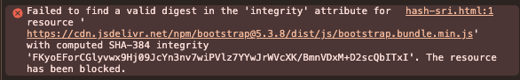
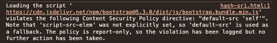

# Content Security Policy (CSP) in Modern Web Apps

## Difesa XSS e PoC con Quarkus

---

## Agenda

- **Introduzione CSP**
- **Direttive principali**
- **Strategie & deployment** (App, Gateway, Reverse Proxy) + duplicati/multilivello
- **PoC Quarkus** (filtro vs proprietà, nonce/hash)
- **Testing & strumenti**

<!--
Note (relatore):
- Tempi indicativi: adatta in base alle domande.
- Obiettivo: baseline CSP + PoC concreta.
- Chiedi chi usa già CSP o gateway per tarare esempi.
-->

---

## Cos’è la CSP e perché conta

- **Definizione**: Policy di sicurezza via header HTTP che limita le sorgenti di contenuti (script, stile, immagini, font, connessioni...).
- **Obiettivo**: Mitigare XSS, clickjacking e data injection riducendo la superficie di attacco.
- **Funzionamento**: Il browser applica le direttive e blocca contenuti non conformi.
- **Rollout sicuro**: Usa inizialmente `Content-Security-Policy-Report-Only` per osservare violazioni senza bloccare.
- **Versioni & specifiche**: [CSP Level 2](https://www.w3.org/TR/CSP2/), [CSP Level 3](https://www.w3.org/TR/CSP3/), [Level 4 (Draft)](https://w3c.github.io/webappsec-csp/), panoramica su [MDN](https://developer.mozilla.org/en-US/docs/Web/HTTP/Headers/Content-Security-Policy).

---

## CSP vs `X-XSS-Protection`

<!--
_class: compact
-->

- **Scopo**:
  - CSP: controllo delle origini dei contenuti (script, stile, img, ecc.) e mitigazione ampia di XSS/injection.
  - X-XSS-Protection: abilita/disabilita il vecchio filtro XSS del browser (riflected XSS) con `1`, `1; mode=block`, `0`.
- **Stato supporto**:
  - CSP: standard moderno, supporto trasversale.
  - X-XSS-Protection: deprecato/abbandonato nei browser moderni (Chromium/Edge lo hanno rimosso; Firefox non lo ha mai supportato; supporto incoerente altrove).
- **Limiti**:
  - CSP: richiede tuning ma offre difesa "in profondità" (nonce/hash, strict-dynamic, report).
  - X-XSS-Protection: copre solo riflessi semplici, facilmente bypassabile, può introdurre rotture o leak; non è difesa affidabile.
- **Raccomandazione**:
  - Preferisci CSP; continua a fare escaping/sanitizzazione lato server e client.
  - Disabilita esplicitamente il filtro legacy dove presente: `X-XSS-Protection: 0`.

Esempio confronto header:

```http
# CSP (enforce)
Content-Security-Policy: default-src 'self'; script-src 'self' 'nonce-{nonce}' 'strict-dynamic' https:; frame-ancestors 'none'; base-uri 'self'

# Disabilita filtro legacy per user agent che ancora lo onorano
X-XSS-Protection: 0
```

---

## Direttive principali (panoramica)

- **default-src**: Fallback per tutte le tipologie (es. `'self'`).
- **script-src**: Sorgenti per JavaScript. Supporta `'nonce-<val>'`, `'sha256-<hash>'`, `'strict-dynamic'`, evita `'unsafe-inline'`.
- **style-src**: Sorgenti CSS. Preferisci hash/nonce, evita `'unsafe-inline'` se possibile.
- **img-src**: Sorgenti immagini (attenzione a `data:` e `blob:` se non necessari).
- **connect-src**: Endpoint fetch/XHR/WebSocket/EventSource.
- **font-src**, **media-src**, **frame-src**, **worker-src**: Tipologie specifiche.
- **frame-ancestors**: Controlla chi può incorniciare la pagina (anti-clickjacking).
- **base-uri**: Limita `<base>`;
- **upgrade-insecure-requests**: forza https.

<!--
Note (relatore – direttive principali):
- Obiettivo: chiarire ruolo di ogni direttiva e scelte sicure.
- default-src: fallback iniziale; usa 'self' come base, evita wildcard.
- script-src: evita 'unsafe-inline'/'unsafe-eval'; spiega nonce/hash e 'strict-dynamic' con esempi.
- style-src: preferisci hash/nonce; valuta se rimuovere 'unsafe-inline' (compatibilità librerie legacy).
- img-src: consenti data:/blob: solo se indispensabili (upload/canvas); evidenzia impatti su performance.
- connect-src: includi API, telemetria, WebSocket (wss://); evita '*', specifica domini.
- font-src/media-src/frame-src/worker-src: consenti solo origini necessarie; abbina SRI dove possibile.
- frame-ancestors: differenza rispetto a X-Frame-Options; mostra 'none' vs domini ammessi.
- base-uri: impedisce abuso di <base>; raccomanda 'self'.
- upgrade-insecure-requests: utile in migrazione a https; verifica asset misti.
Suggerimento: mostra in DevTools il blocco di uno script inline senza nonce per rendere tangibile l'effetto.
-->

---

## `script-src` in dettaglio

- **Nonce**: Generato per richiesta, es. `'nonce-AbCd...'`; consenti solo script con quel attributo.
- **Hash**: `'sha256-...'` su contenuto inline deterministico.
- **strict-dynamic**: Con nonce/hash, delega fiducia a script caricati dinamicamente da quelli autorizzati.
- **Blocca inline non necessari**: Evita `'unsafe-inline'` e `'unsafe-eval'`.

Esempio sicuro:

```csp
Content-Security-Policy: default-src 'self'; \
 script-src 'self' 'nonce-{nonce}' 'strict-dynamic' https:; \
 style-src 'self' https:; img-src 'self' data:; \
 connect-src 'self' https://api.example.com; \
 frame-ancestors 'none'; base-uri 'self'; upgrade-insecure-requests;
```

<!--
Note (relatore - script-src):
 - Nonce vs Hash: nonce per contenuti inline dinamici per richiesta; hash per blocchi inline deterministici (build-time). Entrambi si possono combinare, ma privilegia nonce + 'strict-dynamic'.
 - 'strict-dynamic' affida fiducia agli script caricati da quelli con nonce/hash, riducendo la necessità di whitelist di host; mantieni comunque fallback https: per asset terzi.
 - Evita 'unsafe-inline' e 'unsafe-eval'; consenti 'unsafe-eval' solo se librerie legacy lo richiedono (valuta migrazione).
 - Event handlers inline: usa 'unsafe-hashes' con hash specifici quando devi supportare attributi come onclick.
 - WebAssembly: se necessario, considera 'wasm-unsafe-eval' con cautela.

 Quando usare cosa:
 - Usa **nonce** quando: il markup è generato al volo (template engine), ci sono piccoli blocchi inline che cambiano per richiesta/utente/tenant, vuoi sfruttare 'strict-dynamic' e ridurre whitelist di host.
 - Usa **hash** quando: il contenuto inline è stabile e versionato (snippet deterministici, es. bootstrapping minimo), non puoi gestire un nonce per-request (cache aggressive, pagine statiche), vuoi evitare propagazione del nonce.
 - Evita entrambi quando possibile: sposta il codice inline in file esterni versionati, firma con SRI e consenti solo origin fidati.
 Demo: in DevTools mostra blocco di <script> inline senza nonce; prova un dynamic import da host non whitelisted per evidenziare l'effetto di 'strict-dynamic'.
 Domanda guida: quali asset terzi usate oggi? Mappateli su https: + SRI e valutate se ridurre la whitelist.
-->

---

## Decision tree: nonce vs hash

- Il codice inline cambia per richiesta/utente? → Usa **nonce** + `'strict-dynamic'`.
- Il codice inline è stabile/versionato? → Usa **hash** (`'sha256-…'`).
- Hai cache aggressive/CDN di pagine statiche? → Preferisci **hash**.
- Vuoi ridurre whitelist host e script dinamici trusted? → **nonce** + `'strict-dynamic'`.
- Puoi evitare inline? → Sposta in file esterni + **SRI** (Subresource Integrity); mantieni CSP più semplice.

---

## Decision tree: nonce vs hash (diagramma)



---

## Subresource Integrity (SRI)

- **Cos'è**: garantisce che asset esterni (script/stili) non siano stati manomessi. Il browser usa la risorsa solo se l'hash dichiarato nell'attributo `integrity` coincide con quello del contenuto scaricato.
- **Come si usa**: aggiungi `integrity="sha256|sha384|sha512-<hashBase64>"` e `crossorigin="anonymous"` su risorse da CDN/terze parti.
- **Relazione con CSP**: SRI assicura integrità del singolo asset; CSP controlla le origini consentite. Sono **complementari** e vanno usati insieme.
- **Nota compatibilità**: la direttiva CSP `require-sri-for` non è ampiamente supportata; applica SRI via build/pipeline invece di farlo imporre dalla CSP.

> Il sito https://srihash.org/ può aiutarti a generare gli hash SRI per le tue risorse esterne.
---

## Subresource Integrity (SRI) - esempi (1/2)

Esempi:

```html
<link href="https://cdn.jsdelivr.net/npm/bootstrap@5.3.8/dist/css/bootstrap.min.css" 
rel="stylesheet" 
integrity="sha384-sRIl4kxILFvY47J16cr9ZwB07vP4J8+LH7qKQnuqkuIAvNWLzeN8tE5YBujZqJLB" crossorigin="anonymous">

<script src="https://cdn.jsdelivr.net/npm/bootstrap@5.3.8/dist/js/bootstrap.bundle.min.js" 
integrity="sha384-FKyoEForCGlyvwx9Hj09JcYn3nv7wiPVlz7YYwJrWVcXK/BmnVDxM+D2scQbITxI" 
crossorigin="anonymous">
</script>
```

Generazione hash (sha384):

```bash
# Esempio per bootstrap.bundle.min.js (risorsa locale)
openssl dgst -sha384 -binary bootstrap.bundle.min.js | openssl base64 -A

# Esempio per risorsa remota
curl -s https://cdn.jsdelivr.net/npm/bootstrap@5.3.8/dist/js/bootstrap.bundle.min.js | openssl dgst -sha384 -binary | openssl base64 -A

# Usa: integrity="sha384-<outputBase64>"
```

---

## Subresource Integrity (SRI) - esempi (2/2)

Le due immagini a seguire mostrano l’effetto di SRI e CSP in azione. In particolare:

- la prima immagine mostra una risorsa il cui hash non corrisponde a quello atteso, che viene quindi bloccata dal browser;
- la seconda immagine mostra come il tentativo di caricare lo script stia violando la policy CSP definita, risultando anch’esso bloccato perché non conforme alla direttiva `script-src`.




<!--
Note (relatore – SRI):
- Mostra in DevTools che una risorsa con hash errato viene bloccata (network + console).
- Spiega che SRI protegge anche da compromissioni di CDN ma non sostituisce CSP.
- Evidenzia necessità di `crossorigin="anonymous"` per asset cross-origin; senza, SRI può fallire, il browser caricherà la risorsa ma non verificherà l'integrità, perdendo di fatto la protezione offerta da SRI.
- Ricorda di rigenerare gli hash ad ogni modifica/versione degli asset e di automatizzare in CI/CD.
-->

---

## Baseline CSP per SPA (Single Page Application) con CDN

- **Scenario**: App SPA con asset su CDN.
- **Policy**:

```csp
Content-Security-Policy: default-src 'self'; \
 script-src 'self' https://cdn.example.com 'nonce-{nonce}' 'strict-dynamic' https:; \
 style-src 'self' https://cdn.example.com; \
 img-src 'self' https://cdn.example.com data:; \
 font-src 'self' https://cdn.example.com; \
 connect-src 'self' https://api.example.com; \
 frame-ancestors 'none'; base-uri 'self'; upgrade-insecure-requests;
```

<!--
Note (relatore – SPA/CDN):
- CDN: preferisci origin specifici (no wildcard) e abbina Subresource Integrity (SRI) per script/stile esterni.
- 'data:' e 'blob:': abilitali solo se indispensabili (upload/download, canvas); rimuovili dalla policy se non usati.
- 'connect-src': includi endpoint di telemetria, WebSocket (wss://), e API di terze parti realmente necessarie.
- Considera split policy tra rotte statiche (/static) e app dinamica, con `.path` in Quarkus.
- Usa 'upgrade-insecure-requests' per forzare https su asset misti.
 Demo: rimuovi temporaneamente `data:` da img-src per mostrare i blocchi; aggiungi SRI a uno script CDN e evidenzia la differenza.
 Domanda guida: CDN aziendale o pubblico? Preferisci origin specifici e versionamento degli asset.
-->

---

## Dove impostare la CSP (strategie)

- **Applicazione** (in questo caso **Quarkus)**: Massimo controllo, supporto nonce per richiesta.
- **API Gateway (Kong, 3Scale, Apigee)**: Centralizza; utile per microservizi multipli.
- **Reverse Proxy (Nginx/Apache)**: Performante; separa responsabilità ops/app.

Scegli un solo punto di verità per ridurre conflitti.

> Significa decidere dove viene generata e mantenuta la policy principale (applicazione o edge) e garantire che gli altri livelli non impongano direttive concorrenti.

<!--
Note (relatore):
- Se Edge impone CSP, evita `script-src` dinamico lì; tienilo in app.
- Ricorda: più header CSP si sommano (intersezione), non vince l’ultimo.
- Esempio microfrontend: policy diverse per-app con nonce.
-->

---

## Duplicati e multilivello: come si comporta il browser

- **Header duplicati (più `Content-Security-Policy`)**: ogni header è una policy separata e il browser le applica tutte. L’effetto è l’**intersezione** (vince la più restrittiva). Non “vince l’ultimo”.
- **Direttive duplicate nello stesso header**: i browser conformi considerano la prima occorrenza della direttiva e ignorano le successive.
- **`Report-Only`**: non applica blocchi, ma registra violazioni. Più header `-Report-Only` generano più report.
- **Edge che riscrive header**: se proxy/reverse proxy usa "set" può sovrascrivere l’header dell’app e quindi eliminare la policy a valle. Usa modalità "append/add" quando vuoi cumulare.

---

## Definire policy a più livelli senza conflitti

<!--
_class: compact
-->

- **Pattern consigliato**:
  - Edge/Gateway in enforce su direttive statiche: `frame-ancestors`, `base-uri`, `upgrade-insecure-requests`.
  - Applicazione in enforce su direttive dinamiche: `script-src`/`style-src` con `nonce`/`hash`, `connect-src`, `img-src`.
- **Motivazione**: l’edge non conosce il `nonce`; se impone `script-src` troppo restrittivo, può bloccare inline con nonce dell’app.
- **Alternative sicure**:
  - Edge/Gateway in `Report-Only`, App in `Enforce`, finché la policy non è stabilizzata.
  - Se l’edge deve applicare `script-src`, includi almeno `'nonce-*'`/`'sha256-*'` o una regola compatibile con il modello dell’app (quando supportato dal prodotto) e usa "append".
- **Regola d’oro**: evita che più livelli impongano direttive dinamiche su `script-src`/`style-src`; centralizzale nell’app. Metti all’edge ciò che è invariabile.

<!--
Note (relatore):
- Caso reale: Edge in Report-Only 2 settimane, poi enforce graduale.
- Safari: verifica compatibilità di direttive avanzate, testa cross-browser.
- Evita wildcard ampie (https:) senza strict-dynamic: rischio supply chain.
-->

---

## Quarkus: proprietà vs filtro (quando usare cosa)

<!--
_class: compact
-->

- **Proprietà** `quarkus.http.header."Content-Security-Policy".value` (+ `.path`):
  - Semplice e dichiarativo per policy **statiche** e per-scopo di **path**.
  - Ottimo per baseline e direttive fisse (es. `frame-ancestors`, `base-uri`, `upgrade-insecure-requests`).
  - Usa `"Content-Security-Policy-Report-Only"` in fase di tuning.
- **Filtro ad hoc** (`ContainerResponseFilter`):
  - Necessario per CSP **dinamica**: `nonce` per richiesta, hash calcolati, per-utente/tenant/feature flag.
  - Consente di **passare il nonce** ai template (Qute/Thymeleaf) e usare `'strict-dynamic'` in sicurezza.
- **Coesistenza senza conflitti**:
  - Evita di impostare `script-src`/`style-src` sia via proprietà che via filtro sulla **stessa rotta**.
  - Se vuoi tenere baseline a proprietà e dinamiche a filtro, limita le proprietà con `.path` a rotte statiche e lascia che il filtro faccia `putSingle` per sostituire l’header sull’app.

Esempi `application.properties`:

```properties
# Profilo dev: osserva violazioni senza bloccare
%dev.quarkus.http.header."Content-Security-Policy-Report-Only".value=default-src 'self'; frame-ancestors 'none'; base-uri 'self'
%dev.quarkus.http.header."Content-Security-Policy-Report-Only".path=/

# Profilo prod: baseline statica su un prefisso di path
%prod.quarkus.http.header."Content-Security-Policy".value=default-src 'self'; frame-ancestors 'none'; base-uri 'self'; upgrade-insecure-requests
%prod.quarkus.http.header."Content-Security-Policy".path=/static
```

<!--
Note (relatore):
- Proprietà per baseline e path statici (asset, health, static).
- Filtro per nonce per richiesta: mostrane l’uso nei template e attenzione a cache condivise.
- Evita sovrapposizioni sulla stessa rotta: proprietà limitate con `.path`, filtro `putSingle`.
-->

---

## PoC Quarkus: impostare l’header CSP

- **Obiettivo**: generare un `nonce` per ogni richiesta e applicarlo nella direttiva `script-src` con `'strict-dynamic'`.
- **Vantaggi**: blocca script inline non autorizzati, riduce whitelist di host, supporta script caricati dinamicamente.
- **Implementazione**: via `ContainerResponseFilter` e `ContainerRequestFilter` per generare e applicare un `nonce` per richiesta.
- **Passaggio del nonce**: opzionale, ma utile per usarlo nei template HTML (Qute/Thymeleaf).

---

<!--
_class: compact
-->

```java
package io.github.amusarra.csp.filter;

@Provider
@Priority(Priorities.HEADER_DECORATOR)
public class CspFilter implements ContainerRequestFilter, ContainerResponseFilter {

  @Override
  public void filter(ContainerRequestContext requestContext) throws IOException {
    // Generiamo il nonce già nella fase di request, così è disponibile per il template
    String nonce = UUID.randomUUID().toString().replace("-", "");
    requestContext.setProperty("csp-nonce", nonce);
  }

  @Override
  public void filter(ContainerRequestContext requestContext,
                     ContainerResponseContext responseContext) {
    // Recuperiamo il nonce impostato nella request (fallback se mancante)
    String nonce = (String) requestContext.getProperty("csp-nonce");
    if (nonce == null) {
      nonce = UUID.randomUUID().toString().replace("-", "");
    }

    // Lo passiamo alla richiesta per poterlo usare nell'HTML (opzionale)
    requestContext.setProperty("csp-nonce", nonce);

    // Impostiamo l'header con il nonce
    // Aggiunta di font-src per autorizzare fonts embedded (data:) e risorse self/https
    String policy = "default-src 'self'; " +
                    "script-src 'self' 'nonce-" + nonce + "' 'strict-dynamic' https:; " +
                    "style-src 'self' https:; " +
                    "font-src 'self' data: https:; " +
                    "img-src 'self' data:; " +
                    "connect-src 'self'; frame-ancestors 'none'; base-uri 'self'; upgrade-insecure-requests;";

    responseContext.getHeaders().putSingle("Content-Security-Policy", policy);
    // opzionale: modalità report-only in fase di tuning
    // responseContext.getHeaders().putSingle("Content-Security-Policy-Report-Only", policy + " report-to default");
    // Passa il nonce a template/front-end (es. via header custom o attributi request)
    responseContext.getHeaders().putSingle("X-CSP-Nonce", nonce);
  }
}
```

<!--
Note (relatore):
- Sottolinea `SecureRandom` e la lunghezza del nonce come esempio.
- Spiega `putSingle` (sostituisce) vs `add` (accoda) e perché sostituire qui.
- Dimostra con DevTools: script senza nonce bloccato.
-->
---

## PoC Quarkus: usare il `nonce` nel template

```html
<script nonce="{nonce}">
    console.log("Script legittimo eseguito con nonce: {nonce}");
</script>

<script>
    alert("XSS Attacco! Se vedi questo, la CSP non sta bloccando gli script inline non autorizzati.");
</script>
```

In Quarkus, inserisci `nonce` nel modello (Qute/Thymeleaf) recuperando il valore da `X-CSP-Nonce` o da uno `RequestScoped` bean.

---

## Mitigazione XSS: impatto reale

- **Blocca payload inline**: `<script>alert(1)</script>` respinto senza nonce/hash.
- **Riduce DOM-based XSS**: Con `'strict-dynamic'`, script dinamici non fidati vengono bloccati.
- **Clickjacking**: `frame-ancestors 'none'` impedisce l’incorniciamento.
- **Limitazioni**: CSP non sostituisce sanitizzazione/escaping; è un controllo difensivo complementare.

---

## Testing & strumenti

- **DevTools**: Vedi violazioni nella console e nel pannello Security.
- **CSP Evaluator (Google)**: Analizza policy, trova debolezze.
- **securityheaders.com**: Verifica header di sicurezza in produzione.
- **Report-URI / Report-To**: Raccogli violazioni; monitora in tempo reale.
- **Automazione**: `curl -I`, test E2E (Playwright), scansioni OWASP ZAP.

```bash
# Verifica header
curl -s -I https://app.example.com | grep -i content-security-policy

# Esempio di output
Content-Security-Policy-Report-Only: default-src 'self'; frame-ancestors 'none'; base-uri 'self'
```

<!--
Note (relatore):
- Suggerisci controllo header in CI (curl/Playwright) e uso di SecurityHeaders.
- Spiega differenza `Report-To` (Reporting API) vs `report-uri` legacy.
- Mostra un esempio di violazione raccolta e come aggiornare la policy.
-->

---

## Rollout sicuro (Report-Only → Enforce)

1. **Definisci policy** iniziale e abilita `Report-Only` con endpoint di raccolta.
2. **Osserva violazioni**, mappa sorgenti legittime, aggiorna policy.
3. **Integra nonce/hash** dove necessario (script critici).
4. **Passa a enforce** gradualmente, mantieni report attivi.

---

## Errori comuni e best practice

- Evita wildcard eccessivi (`*`, `https:`) senza `'strict-dynamic'`.
- Non affidarti a `'unsafe-inline'`: usa nonce/hash.
- Valuta `data:` e `blob:` solo se indispensabili.
- Centralizza la gestione CSP per coerenza.
- Documenta le sorgenti consentite e revisiona periodicamente.

---

## Risorse

- Spec: [MDN Web Docs - Content Security Policy](https://developer.mozilla.org/en-US/docs/Web/HTTP/Headers/Content-Security-Policy)
- [Google CSP Evaluator](https://csp-evaluator.withgoogle.com/)
- [Report-URI](https://report-uri.com/) / [W3C Reporting API](https://www.w3.org/TR/reporting/)
- [OWASP Cheat Sheet: Content Security Policy](https://cheatsheetseries.owasp.org/cheatsheets/Content_Security_Policy_Cheat_Sheet.html)

---

## Q&A

Domande e discussione

---


## Grazie per l'attenzione! 🙏

### **Antonio Musarra**

*Software Engineer @ Sogei*
*Technical Writer/Blogger*

🐙 [github.com/amusarra](https://github.com/amusarra)
💼 [linkedin.com/in/amusarra](https://linkedin.com/in/amusarra)

**Repository del progetto della PoC**
https://github.com/amusarra/csp-lab-poc
